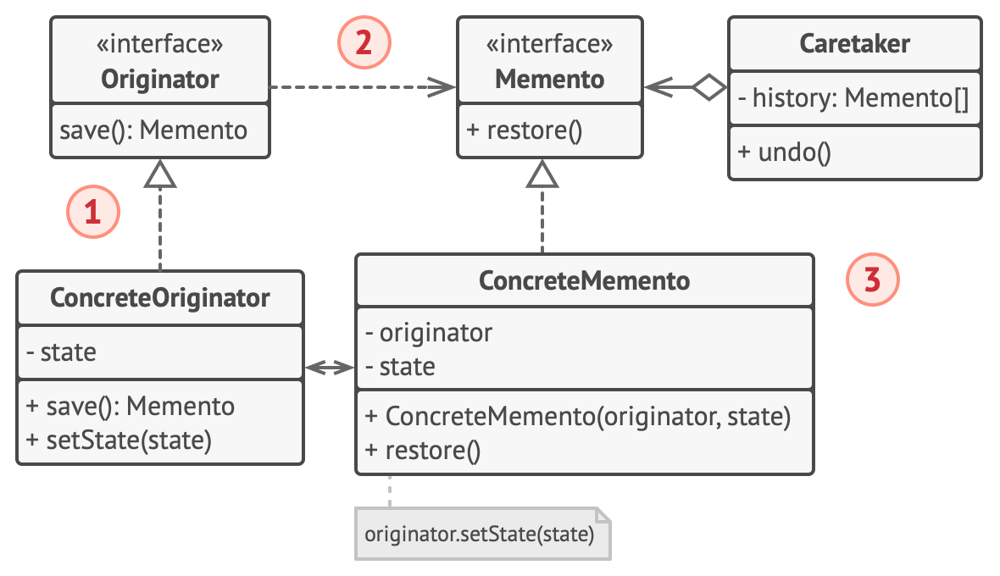
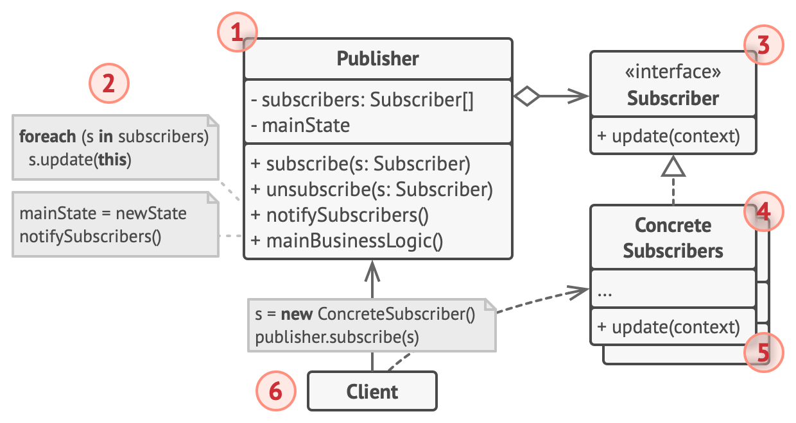
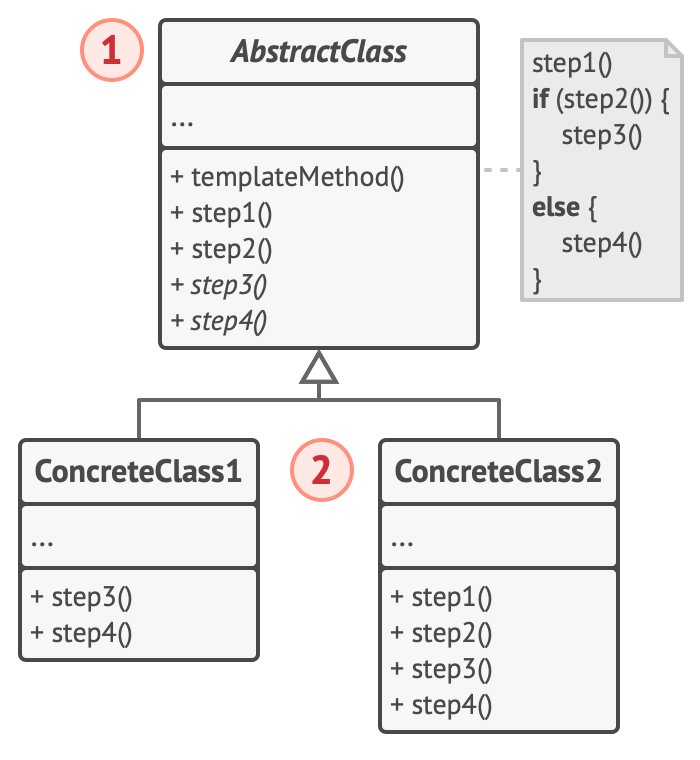

# Behavioral patterns

[Chain of Responsibility](#chain-of-responsibility)

[Command](#command)

[Iterator](#iterator)

[Mediator](#mediator)

[Memento](#memento)

[Observer](#observer)

[State](#state)

[Strategy](#strategy)

[Template Method](#template-method)

[Visitor](#visitor)

## Chain of Responsibility

### Help Desk Ticketing System

In a help desk ticketing system, a user's problem report is passed through various levels of technical support. The first level handles basic issues, and if it cannot resolve the ticket, it forwards it to the second level of support, and so on, until the problem is resolved.

### Event Logging

In a logging system, various modules can process log events at different levels (e.g., DEBUG, INFO, WARN, ERROR). A log event is passed through a chain of loggers, with each deciding whether to log the event or pass it on.

### Request Processing in Web Applications

In web applications, HTTP requests are often processed by a chain of filters or middleware. Each filter can process the request (e.g., authentication, authorization, data validation) and decide whether to pass it to the next filter or to stop processing.

### Command Handling in Software

In applications that interpret user commands (e.g., text editors, graphic software), each command is passed through a chain of objects that handle different types of commands. Each object checks if it can handle the given command and, if not, passes it to the next object in the chain.

### Request Authorization in Security Systems

In security systems, access requests to resources are passed through a chain of authorization policies. Each policy checks if it meets certain authorization criteria and, if so, grants access. If not, the request is passed to the next policy in the chain.

## Command

The "Command" design pattern involves encapsulating a request as an object, allowing clients to be parameterized with different requests, queue or log requests, and support undoable operations. Here are several real-world examples of this pattern in use:

### Undo/Redo Operations in Text Editors

In text editors, each user action (e.g., typing text, deleting text, changing formatting) is encapsulated as a Command object. This allows for easy undo and redo operations because the history of executed commands can be stored.

### Order Processing in Transaction Systems

In transaction systems, each transaction (e.g., bank transfer, online purchase) is encapsulated as a Command object. This facilitates managing transactions, ensuring their reliability, and implementing retry mechanisms in case of failure.

### Macros in Software Applications

In applications that allow macro creation, a series of commands executed by the user is recorded as a sequence of Command objects. This enables replaying macros to automate tasks, increasing the user's efficiency.

### UI Control in Desktop Applications

In desktop applications, actions triggered by the user interface (e.g., button clicks, menu selections) are represented as Command objects. This simplifies managing actions, allows dynamically assigning commands to UI elements, and supports undo/redo functionality.

### Task Management in Queueing Systems

In queueing systems, each task (e.g., file processing, sending an email) is represented as a Command object. This facilitates easy queuing, prioritizing, and retrying tasks, ensuring flexible and reliable processing.

## Iterator

The "Iterator" design pattern allows for sequential access to elements of a collection without exposing its internal structure. Here are several real-world examples of this pattern in use:

### Browsing a List of Files in a File Manager

In a file manager, a user can browse through a list of files and folders. An iterator is used to traverse the elements of the list, enabling the user to navigate without needing to know the internal structure of the data.

### Visiting Nodes in an XML Tree

When processing an XML document, an iterator can be used to visit the nodes of the XML tree. This allows for sequentially browsing elements without delving into the details of the tree structure.

### Traversing a Collection of Objects in E-commerce Applications

In e-commerce applications, a list of products can be browsed using an iterator. This allows the user to sequentially view available products, regardless of how the list is internally implemented.

### Navigating through GUI Elements in Desktop Applications

In desktop applications, an iterator can be used to traverse GUI elements, such as buttons, text fields, and other controls. This allows operations on these elements in a uniform manner without revealing implementation details.

### Iterating Through Query Results in a Database

After executing a query in a database, an iterator can be used to traverse the query results. This allows for sequential processing of each result without needing to know the details of data storage and structure in the database.

## Mediator

The "Mediator" design pattern defines an object that encapsulates how a set of objects interact. This pattern promotes loose coupling by preventing direct communication between objects, allowing for independent changes in their interactions. Here are several real-world examples of this pattern in use:

### Managing Interactions in User Interfaces

In applications with complex user interfaces (e.g., forms with multiple fields and buttons), a mediator can manage interactions between UI elements. For example, a change in one field may affect another field or button. The mediator facilitates these interactions, simplifying logic and reducing dependencies between components.

### Chat Systems

In chat applications, a mediator can manage communication between users. Instead of users communicating directly with each other, each user sends messages to the mediator, which then forwards them to the appropriate recipients. This makes it easier to manage multiple simultaneous conversations and add new features (e.g., content filtering).

### Air Traffic Control

In air traffic control systems, the mediator (air traffic controller) coordinates communication between aircraft. Instead of aircraft communicating directly with each other, all messages go through the air traffic controller, who manages landings, take-offs, and air traffic flow, preventing collisions and optimizing traffic.

### Managing Modules in Modular Applications

In applications composed of many independent modules, a mediator can manage interactions between these modules. For example, in an ERP system, different modules (accounting, inventory management, sales) can communicate through the mediator, which coordinates their actions and data exchange.

### Telephone Switchboard

In traditional telephone switchboards, the mediator (switchboard) facilitates connections between subscribers. Instead of subscribers connecting directly, the switchboard routes calls, managing communication and enabling additional features like call forwarding and conferencing.

## Memento

The "Memento" design pattern involves storing the state of an object so that it can be restored to that state in the future. This allows for preserving the history of changes to an object and enables operations like undo. Here are several real-world examples of this pattern in use:

### Undo Operations in Text Editors

In text editors, every change to the document (e.g., typing text, deleting a fragment) is saved as a memento object. This allows the user to undo and redo changes, enabling easy restoration of previous versions of the document.

### Saving Game State in Video Games

In video games, the game state (e.g., player position, health level, inventory) is stored as a memento object. This allows players to save their progress and later restore the game state, which is particularly useful for difficult levels or risky actions.

### Managing Configuration in Applications

In applications that allow configuration changes (e.g., user settings, personalization options), the configuration state can be stored as a memento. This allows users to restore previous settings if new changes are undesirable or cause issues.

### Version Control Systems

In version control systems (e.g., Git), each version of a file or set of files is stored as a memento. This allows developers to revert to earlier versions of the code, compare changes, and restore the project state before introducing bugs.

### Database Operations

In databases, before performing critical operations (e.g., mass updates, data deletions), the current state of the data can be saved as a memento. This allows for restoring the data to its previous state in case of errors or unexpected issues after the operation.

## Observer

The "Observer" design pattern involves defining a one-to-many dependency between objects so that when one object changes state, all its dependents are notified and updated automatically. Here are several real-world examples of this pattern in use:

### Notification System in Mobile Applications

In mobile applications, when a user receives new messages, notifications are sent to various UI elements (e.g., app icon, notification bar). Each element is an observer and is notified of new messages to update its state accordingly.

### Tracking Changes in Spreadsheets

In spreadsheets, changing the value of one cell can affect other dependent cells (e.g., cells containing formulas). Dependent cells are observers and are notified of changes so they can update their values.

### Stock Price Updates in Financial Applications

In financial applications, investors can subscribe to notifications about stock price changes. When a stock price changes, all subscribed applications or components are notified, allowing them to immediately update the displayed data.

### Publish/Subscribe Systems in Social Media

In social media, users can follow other users and be notified of their new posts. Each observer (user) is notified of new posts, allowing them to see updates in their news feed.

### Monitoring Sensor Status in IoT Systems

In IoT (Internet of Things) systems, various sensors monitor the environment (e.g., temperature, humidity). When sensors detect changes, they notify a central system or other dependent devices, which are observers, allowing for immediate response to changes.

Extended version with EventManager

## State

The "State" design pattern allows an object to change its behavior when its internal state changes. The object appears to change its class. Here are several real-world examples of this pattern in use:

### Vending Machine

A vending machine can be in different states (e.g., no coin, coin inserted, product dispensed). Each state changes how the machine operates. For example, when in the "no coin" state, it won't dispense a product, but after a coin is inserted, it transitions to the "coin inserted" state and allows product selection.

### Document in a Workflow Process

A document in a workflow management application can transition through various states (e.g., draft, in review, approved). Each state determines what actions are possible (e.g., a document in the "draft" state can be edited but not yet published).

### Character in a Video Game

A character in a video game can have different states (e.g., healthy, injured, dead). In each state, the character behaves differently—when healthy, it can run and fight; when injured, it may move slower; and when dead, it cannot perform any actions.

### Network Connection Management

In network applications, a connection can be in different states (e.g., connecting, connected, disconnected). Each state defines what operations are allowed—while "connecting," it can attempt to establish a connection; when "connected," it can transmit data; and when "disconnected," it can attempt to reconnect.

### Order Process in an Online Store

The order process in an online store can go through various states (e.g., new, processing, shipped, delivered). Each state changes the available options for the customer—a new order can be canceled, a processing order can be tracked, and a delivered order can be reviewed.

## Strategy

The "Strategy" design pattern allows you to define a family of algorithms, encapsulate each one in a separate class, and make them interchangeable. This way, the client can choose which algorithm to use at runtime. Here are several real-world examples of this pattern in use:

### Data Sorting

In applications that need to sort data, various sorting algorithms can be implemented (e.g., bubble sort, insertion sort, quick sort). The "Strategy" pattern allows these algorithms to be stored as separate classes and dynamically chosen based on the needs and conditions, such as the size of the data set or performance requirements.

### Payment Methods in Online Stores

Online stores can offer different payment methods (e.g., credit card, PayPal, bank transfer). Each payment method is implemented as a separate class, and the "Strategy" pattern allows the customer to select their preferred payment method during the checkout process.

### Image Composition in Graphic Applications

In graphic applications, various image composition strategies can be used (e.g., transparency, overlay, blending). The "Strategy" pattern allows the user to choose which composition technique to apply during image editing, changing the algorithm at runtime.

### Route Optimization in GPS Navigation

In navigation applications, different strategies for route calculation can be used (e.g., shortest route, fastest route, route avoiding highways). Each strategy is implemented as a separate class, and the "Strategy" pattern allows the user to select their preferred route calculation method.

### Data Compression

In applications that need to compress data, various compression algorithms can be used (e.g., ZIP, RAR, 7z). The "Strategy" pattern allows these algorithms to be stored as separate classes and dynamically chosen based on user needs or file specifications.

## Template Method

## Visitor
