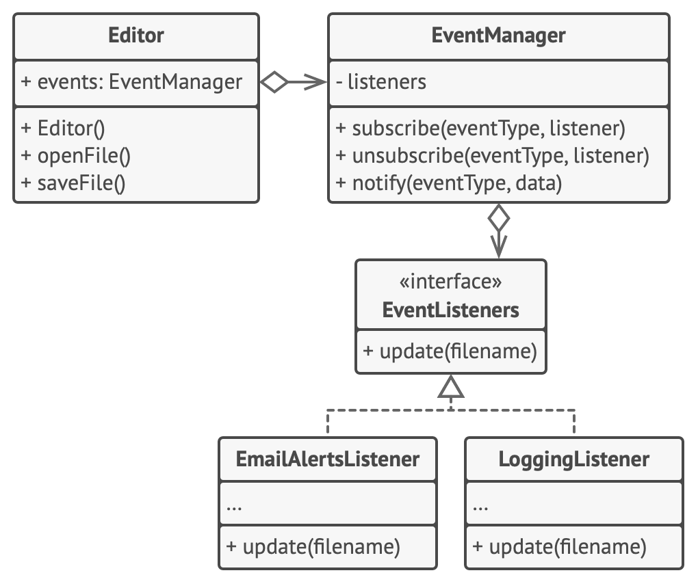
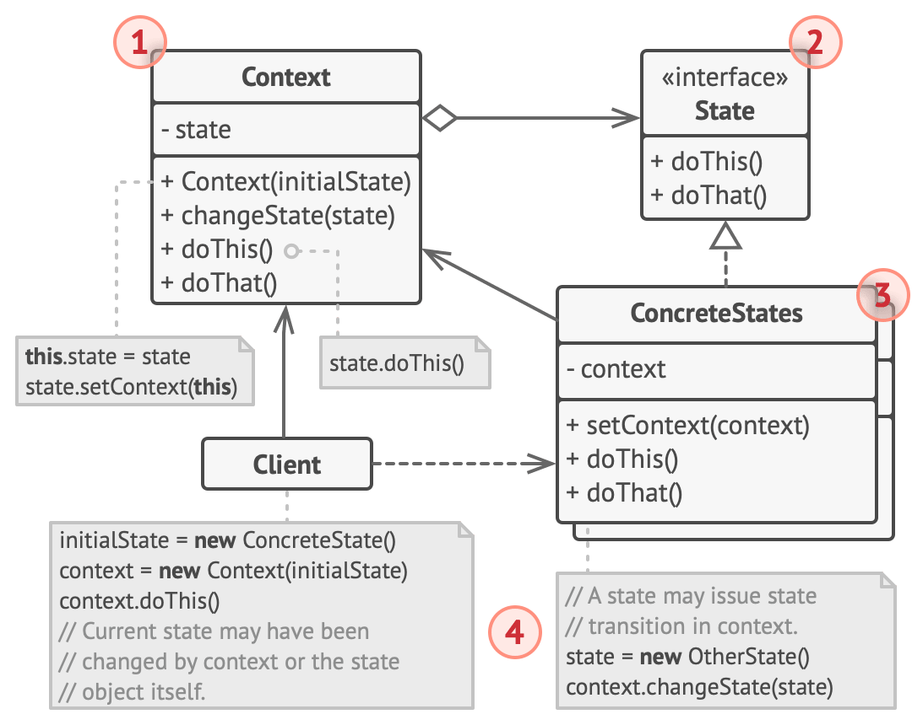

# Behavioral patterns

[Chain of Responsibility](#chain-of-responsibility)

[Command](#command)

[Iterator](#iterator)

[Mediator](#mediator)

[Memento](#memento)

[Observer](#observer)

[State](#state)

[Strategy](#strategy)

[Template Method](#template-method)

[Visitor](#visitor)

## Chain of Responsibility

Wzorzec projektowy "Chain of Responsibility" polega na przekazywaniu żądań przez łańcuch odbiorców, aż jedno z nich obsłuży żądanie. Oto kilka realnych przykładów zastosowania tego wzorca:

### System Obsługi Zgłoszeń (Help Desk)

W systemie obsługi zgłoszeń, zgłoszenie problemu od użytkownika jest przekazywane przez różne poziomy wsparcia technicznego. Pierwszy poziom obsługuje podstawowe problemy, a jeśli nie jest w stanie rozwiązać zgłoszenia, przekazuje je do drugiego poziomu wsparcia, i tak dalej, aż problem zostanie rozwiązany.

### Logowanie Zdarzeń (Logging)

W systemie logowania, różne moduły mogą przetwarzać zdarzenia logowania na różnych poziomach (np. DEBUG, INFO, WARN, ERROR). Zdarzenie logowania jest przekazywane przez łańcuch loggerów, a każdy z nich decyduje, czy logować zdarzenie, czy przekazać je dalej.

### Przetwarzanie Żądań w Aplikacjach Webowych

W aplikacjach webowych, żądania HTTP są często przetwarzane przez łańcuch filtrów lub middleware. Każdy filtr może przetwarzać żądanie (np. uwierzytelnienie, autoryzacja, walidacja danych) i decydować, czy przekazać je do następnego filtra, czy zakończyć przetwarzanie.

### Obsługa Poleceń w Oprogramowaniu

W aplikacjach, które interpretują polecenia użytkownika (np. edytory tekstu, aplikacje graficzne), każde polecenie jest przekazywane przez łańcuch obiektów obsługujących różne typy poleceń. Każdy obiekt sprawdza, czy może obsłużyć dane polecenie, i jeśli nie, przekazuje je do następnego obiektu w łańcuchu.

### Autoryzacja Żądań w Systemach Bezpieczeństwa

W systemach bezpieczeństwa, żądania dostępu do zasobów są przekazywane przez łańcuch polityk autoryzacyjnych. Każda polityka sprawdza, czy spełnia określone kryteria autoryzacji, i jeśli tak, przyznaje dostęp. Jeśli nie, żądanie jest przekazywane do następnej polityki w łańcuchu.

## Command

Wzorzec projektowy "Command" polega na enkapsulacji żądania jako obiektu, co pozwala na parametryzowanie klientów różnymi żądaniami, kolejkowanie lub logowanie żądań oraz obsługę operacji undo. Oto kilka realnych przykładów zastosowania tego wzorca:

### Operacje Undo/Redo w Edytorach Tekstu

W edytorach tekstu, każda akcja użytkownika (np. wpisanie tekstu, usunięcie tekstu, zmiana formatowania) jest enkapsulowana jako obiekt Command. Pozwala to na łatwe cofanie i ponawianie operacji, ponieważ można przechowywać historię wykonanych poleceń.

### Obsługa Zleceń w Systemach Transakcyjnych

W systemach transakcyjnych, każda transakcja (np. przelew bankowy, zakupy online) jest enkapsulowana jako obiekt Command. Dzięki temu można łatwo zarządzać transakcjami, zapewniając ich niezawodność, a także implementować mechanizmy powtórzeń w przypadku niepowodzenia.

### Makra w Oprogramowaniu

W aplikacjach umożliwiających tworzenie makr, seria poleceń wykonywanych przez użytkownika jest zapisywana jako sekwencja obiektów Command. Pozwala to na odtwarzanie makr w celu automatyzacji zadań, co zwiększa efektywność pracy użytkownika.

### Sterowanie UI w Aplikacjach Desktopowych

W aplikacjach desktopowych, akcje wywoływane przez interfejs użytkownika (np. kliknięcie przycisku, wybór menu) są reprezentowane jako obiekty Command. Ułatwia to zarządzanie akcjami, umożliwia dynamiczne przypisywanie poleceń do elementów UI oraz implementację funkcji undo/redo.

### Zarządzanie Zadań w Systemach Kolejkowych

W systemach kolejkowych, każde zadanie (np. przetwarzanie pliku, wysyłanie e-maila) jest reprezentowane jako obiekt Command. Umożliwia to łatwe kolejkowanie, priorytetyzowanie i ponawianie zadań, co zapewnia elastyczność i niezawodność przetwarzania.

## Iterator

Wzorzec projektowy "Iterator" umożliwia sekwencyjny dostęp do elementów kolekcji bez ujawniania jej wewnętrznej struktury. Oto kilka realnych przykładów zastosowania tego wzorca:

### Przeglądanie Listy Plików w Menedżerze Plików

W menedżerze plików, użytkownik może przeglądać listę plików i folderów. Iterator jest używany do przechodzenia przez elementy listy, umożliwiając użytkownikowi nawigację bez potrzeby znajomości wewnętrznej struktury danych.

### Odwiedzanie Węzłów w Drzewie XML

Podczas przetwarzania dokumentu XML, iterator może być używany do odwiedzania węzłów drzewa XML. Umożliwia to przeglądanie elementów w sposób sekwencyjny, bez konieczności zagłębiania się w szczegóły struktury drzewa.

### Przechodzenie przez Kolekcję Obiektów w Aplikacjach E-commerce

W aplikacjach e-commerce, lista produktów może być przeglądana przez iterator. Pozwala to użytkownikowi na przeglądanie dostępnych produktów w sposób sekwencyjny, niezależnie od tego, jak lista jest zaimplementowana wewnętrznie.

### Nawigacja przez Elementy GUI w Aplikacjach Desktopowych

W aplikacjach desktopowych, iterator może być używany do przechodzenia przez elementy GUI, takie jak przyciski, pola tekstowe i inne kontrolki. Umożliwia to operacje na tych elementach w jednolity sposób, bez ujawniania szczegółów implementacyjnych.

### Iteracja przez Wyniki Zapytania w Bazie Danych

Po wykonaniu zapytania do bazy danych, iterator może być używany do przechodzenia przez wyniki zapytania. Umożliwia to przetwarzanie każdego wyniku w sposób sekwencyjny, bez konieczności znajomości szczegółów dotyczących przechowywania i struktury danych w bazie.

## Mediator

Wzorzec projektowy "Mediator" definiuje obiekt, który enkapsuluje sposób, w jaki zestaw obiektów współdziała. Wzorzec ten promuje luźne powiązania, zapobiegając bezpośredniej komunikacji między obiektami i pozwalając na niezależne zmiany w ich interakcji. Oto kilka realnych przykładów zastosowania tego wzorca:

### Zarządzanie Interakcjami w Interfejsie Użytkownika

W aplikacjach złożonych interfejsów użytkownika (np. formularze z wieloma polami i przyciskami), mediator może zarządzać interakcjami między elementami UI. Na przykład, zmiana w jednym polu może wpłynąć na inne pole lub przycisk. Mediator pośredniczy w tych interakcjach, upraszczając logikę i zmniejszając zależności między komponentami.

### Systemy Czatowe

W aplikacjach do czatowania, mediator może zarządzać komunikacją między użytkownikami. Zamiast bezpośredniej komunikacji między użytkownikami, każdy użytkownik wysyła wiadomości do mediatora, który przekazuje je do odpowiednich odbiorców. Ułatwia to zarządzanie wieloma jednoczesnymi rozmowami i dodawanie nowych funkcji (np. filtrowanie treści).

### Kontrolery Lotów na Lotniskach

W systemach kontroli ruchu lotniczego, mediator (kontroler lotów) koordynuje komunikację między samolotami. Zamiast samoloty komunikowały się bezpośrednio ze sobą, wszystkie komunikaty przechodzą przez kontrolera lotów, który zarządza lądowaniami, startami i ruchem powietrznym, zapobiegając kolizjom i optymalizując przepływ ruchu.

### Zarządzanie Modułami w Aplikacjach Modularnych

W aplikacjach, które składają się z wielu niezależnych modułów, mediator może zarządzać interakcjami między tymi modułami. Na przykład, w systemie ERP różne moduły (księgowość, zarządzanie zapasami, sprzedaż) mogą komunikować się przez mediatora, który koordynuje ich działania i wymianę danych.

### Centrala Telefoniczna

W tradycyjnych centralach telefonicznych, mediator (centrala) pośredniczy w połączeniach między abonentami. Zamiast abonenci łączyli się bezpośrednio, centrala przełącza połączenia, zarządzając komunikacją i umożliwiając dodatkowe funkcje, takie jak przekierowywanie połączeń i konferencje.

## Memento

Wzorzec projektowy "Memento" polega na przechowywaniu stanu obiektu, aby można było przywrócić go do tego stanu w przyszłości. Pozwala to na zachowanie historii zmian obiektu i umożliwia operacje takie jak cofanie (undo). Oto kilka realnych przykładów zastosowania tego wzorca:

### Operacje Cofania w Edytorach Tekstu

W edytorach tekstu, każda zmiana w dokumencie (np. wprowadzenie tekstu, usunięcie fragmentu) jest zapisywana jako obiekt memento. Dzięki temu użytkownik może cofać i przywracać zmiany, umożliwiając łatwe przywracanie poprzednich wersji dokumentu.

### Zapisywanie Stanu Gry w Grach Komputerowych

W grach komputerowych, stan gry (np. pozycja gracza, poziom zdrowia, inwentarz) jest przechowywany jako obiekt memento. Umożliwia to graczowi zapisywanie postępów i późniejsze przywracanie stanu gry, co jest szczególnie przydatne w przypadku trudnych poziomów lub ryzykownych działań.

### Zarządzanie Konfiguracją w Aplikacjach

W aplikacjach, które umożliwiają zmianę konfiguracji (np. ustawienia użytkownika, opcje personalizacji), stan konfiguracji może być przechowywany jako memento. Umożliwia to użytkownikowi przywracanie poprzednich ustawień w przypadku, gdy nowe zmiany są niepożądane lub powodują problemy.

### Systemy Kontroli Wersji

W systemach kontroli wersji (np. Git), każda wersja pliku lub zestawu plików jest przechowywana jako memento. Umożliwia to programistom cofanie się do wcześniejszych wersji kodu, porównywanie zmian i przywracanie stanu projektu sprzed wprowadzenia błędów.

### Operacje w Bazach Danych

W bazach danych, przed wykonaniem krytycznych operacji (np. masowe aktualizacje, usuwanie danych), aktualny stan danych może być zapisany jako memento. Umożliwia to przywracanie danych do poprzedniego stanu w przypadku wystąpienia błędów lub nieoczekiwanych problemów po operacji.

## Observer

Wzorzec projektowy "Obserwator" (Observer) polega na definiowaniu zależności jeden-do-wielu między obiektami, tak aby zmiana stanu jednego obiektu powodowała automatyczne powiadomienie i aktualizację wszystkich zależnych obiektów. Oto kilka realnych przykładów zastosowania tego wzorca:

### System Powiadomień w Aplikacjach Mobilnych

W aplikacjach mobilnych, gdy użytkownik otrzymuje nowe wiadomości, powiadomienia są wysyłane do różnych elementów interfejsu użytkownika (np. ikona aplikacji, pasek powiadomień). Każdy element jest obserwatorem i jest powiadamiany o nowych wiadomościach, aby odpowiednio zaktualizować swój stan.

### Śledzenie Zmian w Arkuszach Kalkulacyjnych

W arkuszach kalkulacyjnych, zmiana wartości jednej komórki może wpływać na inne komórki zależne (np. komórki zawierające formuły). Komórki zależne są obserwatorami i są powiadamiane o zmianach, aby mogły zaktualizować swoje wartości.

### Aktualizacje Kursów Akcji w Aplikacjach Finansowych

W aplikacjach finansowych, inwestorzy mogą subskrybować powiadomienia o zmianach kursów akcji. Gdy kurs akcji się zmienia, wszystkie subskrybowane aplikacje lub komponenty są powiadamiane o zmianie, umożliwiając im natychmiastową aktualizację wyświetlanych danych.

### Systemy Publikacji/Subskrypcji w Mediach Społecznościowych

W mediach społecznościowych, użytkownicy mogą śledzić innych użytkowników i być powiadamiani o ich nowych postach. Każdy obserwator (użytkownik) jest powiadamiany o nowych postach, dzięki czemu może zobaczyć aktualizacje w swoim kanale wiadomości.

### Monitorowanie Stanu Sensorycznego w Systemach IoT

W systemach IoT (Internet of Things), różne sensory mogą monitorować środowisko (np. temperaturę, wilgotność). Gdy sensory wykryją zmiany, powiadamiają o tym centralny system lub inne zależne urządzenia, które są obserwatorami, umożliwiając natychmiastową reakcję na zmiany.

Rozszerzona wersja z EventManagerem

## State

Wzorzec projektowy "State" pozwala obiektowi zmieniać swoje zachowanie w zależności od jego wewnętrznego stanu. Obiekt wygląda jakby zmieniał swoją klasę. Oto kilka realnych przykładów zastosowania tego wzorca:

### Automat Sprzedający

Automat sprzedający może znajdować się w różnych stanach (np. bez monety, moneta wrzucona, produkt wydany). Każdy stan zmienia sposób działania automatu. Na przykład, gdy jest w stanie "bez monety", nie wyda produktu, a po wrzuceniu monety przechodzi do stanu "moneta wrzucona" i pozwala na wybór produktu.

### Dokument w Procesie Pracy

Dokument w aplikacji do zarządzania przepływem pracy może przechodzić przez różne stany (np. szkic, w recenzji, zaakceptowany). Każdy stan określa, jakie akcje są możliwe do wykonania (np. dokument w stanie "szkic" można edytować, ale nie można go jeszcze publikować).

### Postać w Grze Komputerowej

Postać w grze komputerowej może mieć różne stany (np. zdrowy, zraniony, martwy). W każdym stanie postać zachowuje się inaczej - zdrowa może biegać i walczyć, zraniona może poruszać się wolniej, a martwa nie może wykonywać żadnych akcji.

### Zarządzanie Połączeniem w Sieci

W aplikacjach sieciowych połączenie może znajdować się w różnych stanach (np. łączenie, połączone, rozłączone). Każdy stan definiuje, jakie operacje są dozwolone - w stanie "łączenie" można próbować nawiązać połączenie, w stanie "połączone" można przesyłać dane, a w stanie "rozłączone" można ponownie próbować połączyć.

### Proces Zamówienia w Sklepie Internetowym

Proces zamówienia w sklepie internetowym może przechodzić przez różne stany (np. nowe, przetwarzane, wysłane, dostarczone). Każdy stan zmienia dostępne opcje dla klienta - nowe zamówienie można anulować, przetwarzane zamówienie można śledzić, a dostarczone zamówienie można ocenić.

## Strategy

Wzorzec projektowy "Strategia" (Strategy) pozwala zdefiniować rodzinę algorytmów, umieścić je w osobnych klasach i uczynić je wymiennymi. Dzięki temu klient może wybierać algorytm, którego chce użyć, w czasie działania programu. Oto kilka realnych przykładów zastosowania tego wzorca:

### Sortowanie Danych

W aplikacjach, które muszą sortować dane, można zaimplementować różne algorytmy sortowania (np. sortowanie bąbelkowe, sortowanie przez wstawianie, sortowanie szybkie). Wzorzec "Strategia" pozwala przechowywać te algorytmy jako osobne klasy i dynamicznie wybierać odpowiedni algorytm sortowania w zależności od potrzeb i warunków, takich jak rozmiar danych czy wymagania dotyczące wydajności.

### Metody Płatności w Sklepach Internetowych

W sklepach internetowych można zaoferować różne metody płatności (np. karta kredytowa, PayPal, przelew bankowy). Każda metoda płatności jest zaimplementowana jako osobna klasa, a wzorzec "Strategia" pozwala klientowi wybrać preferowaną metodę płatności podczas składania zamówienia.

### Kompozycja Obrazu w Aplikacjach Graficznych

W aplikacjach graficznych można mieć różne strategie kompozycji obrazu (np. przezroczystość, nakładanie, mieszanie). Wzorzec "Strategia" pozwala użytkownikowi wybrać, która technika kompozycji ma być używana podczas edycji obrazu, zmieniając algorytm w czasie działania programu.

### Optymalizacja Trasy w Nawigacji GPS

W aplikacjach nawigacyjnych można zastosować różne strategie wyznaczania trasy (np. najkrótsza trasa, najszybsza trasa, trasa z omijaniem autostrad). Każda strategia jest zaimplementowana jako osobna klasa, a wzorzec "Strategia" umożliwia użytkownikowi wybór preferowanej metody wyznaczania trasy.

### Kompresja Danych

W aplikacjach, które muszą kompresować dane, można zastosować różne algorytmy kompresji (np. ZIP, RAR, 7z). Wzorzec "Strategia" pozwala przechowywać te algorytmy jako osobne klasy i dynamicznie wybierać odpowiedni algorytm kompresji w zależności od potrzeb użytkownika lub specyfikacji plików.

## Template Method

Wzorzec projektowy "Metoda Szablonowa" (Template Method) definiuje szkielet algorytmu w metodzie, pozostawiając niektóre kroki do zaimplementowania w podklasach. Wzorzec ten pozwala podklasom na redefinicję pewnych kroków algorytmu bez zmiany jego struktury. Oto kilka realnych przykładów zastosowania tego wzorca:

### Przetwarzanie Dokumentów

W aplikacjach do przetwarzania dokumentów, takich jak generatory raportów, można zdefiniować ogólny szkielet algorytmu przetwarzania (np. otwarcie dokumentu, przetwarzanie zawartości, zapisanie dokumentu). Konkretne implementacje przetwarzania zawartości (np. formatowanie tekstu, dodawanie nagłówków i stopek) mogą być zrealizowane w podklasach.

### Algorytmy Sortowania

W przypadku algorytmów sortowania, można zdefiniować szkielet metody sortowania, który obejmuje kroki takie jak podział danych, sortowanie podzbiorów i scalanie wyników. Konkretne strategie podziału i sortowania (np. sortowanie szybkie, sortowanie przez scalanie) mogą być zaimplementowane w podklasach.

### Szablony Testów Jednostkowych

W testach jednostkowych, można zdefiniować szablon testu, który zawiera kroki takie jak inicjalizacja środowiska testowego, wykonanie testu i sprawdzanie wyników. Konkretne testy dla różnych funkcjonalności mogą być zaimplementowane w podklasach, które szczegółowo definiują, jak te kroki są wykonywane.

### Proces Zatrudniania

W systemach zarządzania zasobami ludzkimi, można zdefiniować ogólny proces zatrudniania, który obejmuje kroki takie jak przeglądanie CV, przeprowadzanie rozmów kwalifikacyjnych i podejmowanie decyzji. Konkretne kroki, takie jak sposób przeprowadzania rozmów kwalifikacyjnych, mogą być zaimplementowane w podklasach dla różnych typów stanowisk.

### Przygotowanie Potraw w Restauracji

W kuchni restauracyjnej, można zdefiniować szkielet przepisu, który obejmuje kroki takie jak przygotowanie składników, gotowanie i prezentacja dania. Konkretne przepisy dla różnych potraw (np. zupa, danie główne, deser) mogą być zaimplementowane w podklasach, które szczegółowo określają, jak każdy z tych kroków jest wykonywany.

## Visitor