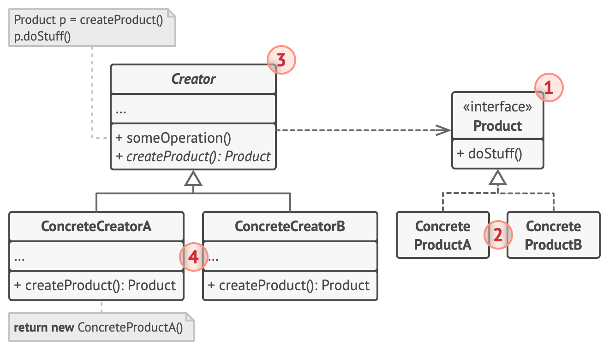
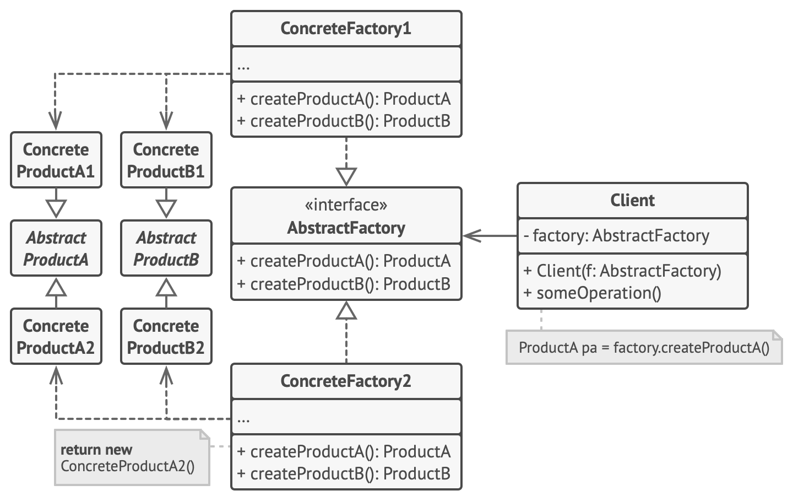
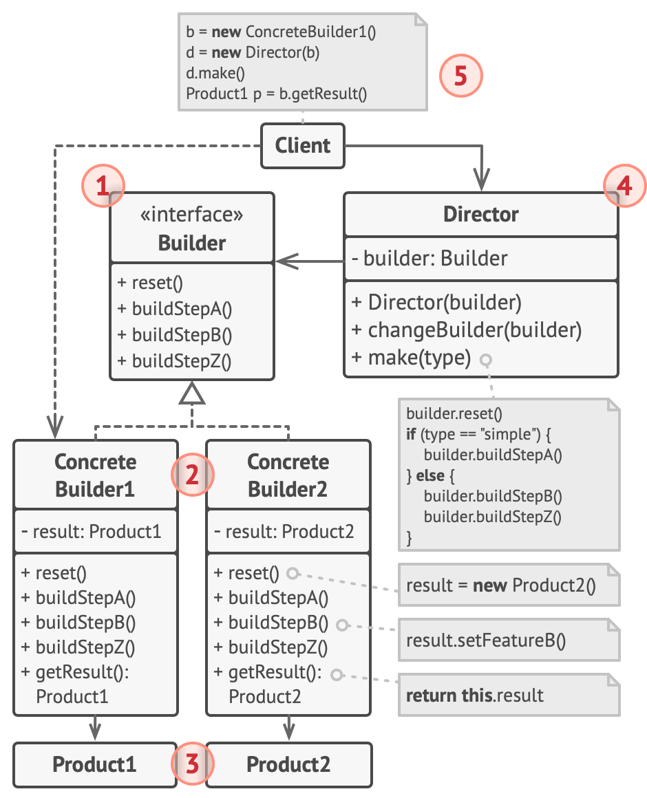
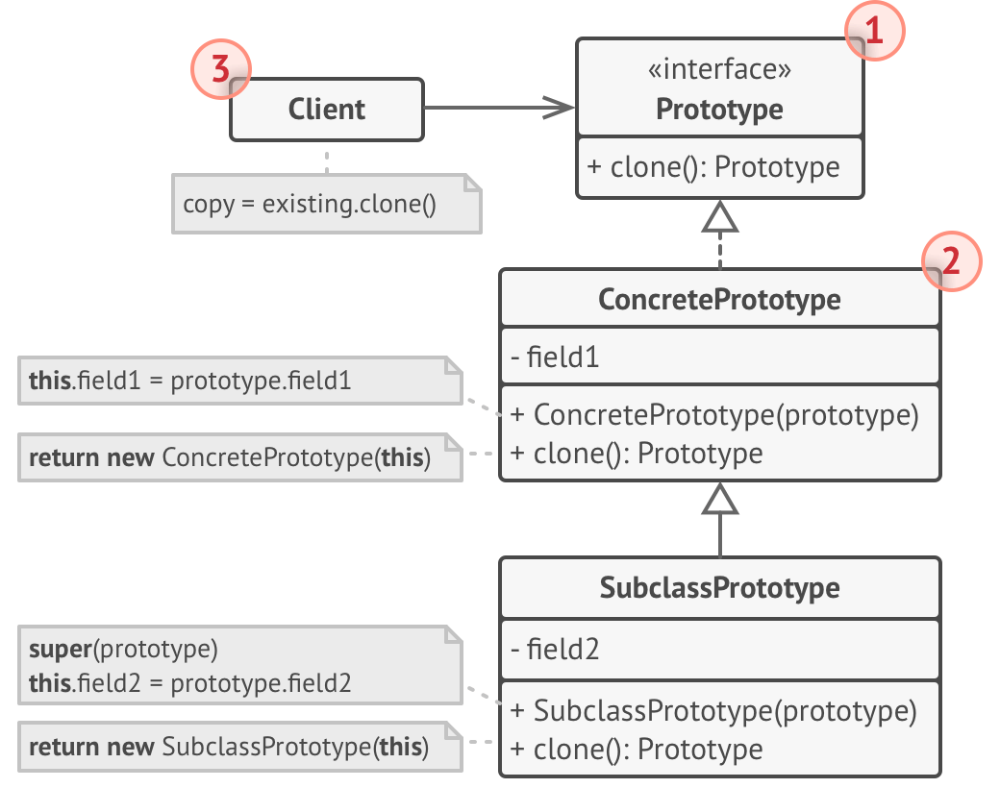

# Creational Design Patterns

[Factory Method](#-factory-method)
[Abstract Factory](#-abstract-factory)
[Builder](#-builder)
[Prototype](#-prototype)
[Singleton](#-Singleton)

`Creational` design patterns provide various object creation mechanisms, which increase flexibility and reuse of existing code.

## Factory Method

`Factory Method` design pattern involves defining a method that returns an object of a specific class but allows subclasses to decide which class to instantiate. This way, the process of creating objects is separated from their implementation. Here are several real-world examples of this pattern in use:

### Creating Documents in a Text Editor

In text editors, there can be different types of documents (e.g., text, HTML, Markdown). The factory method can be used to create the appropriate type of document based on the format chosen by the user. For example, if the user selects the HTML format, the factory method will create an HTML document object.

### Creating Vehicles in a Video Game

In video games where various types of vehicles can be created (e.g., cars, motorcycles, trucks), the factory method can be used to create the appropriate type of vehicle based on the player's choice or the game level. Each type of vehicle is represented by a different class, and the factory method decides which type of vehicle to create.

### Generating Reports in Business Applications

In business applications, various types of reports can be generated (e.g., sales reports, financial reports, inventory reports). The factory method can be used to create the appropriate type of report based on user requirements. For example, the factory method can create a sales report object if the user requests a sales report.

### Creating Accounts in a Banking System

In banking systems, there can be different types of accounts (e.g., savings, checking, fixed deposit). The factory method can be used to create the appropriate type of account based on the customer's choice. For example, if the customer selects a savings account, the factory method will create a savings account object.

### Creating Windows in GUI Applications

In graphical user interface (GUI) applications, various types of windows can be created (e.g., dialog windows, main windows, auxiliary windows). The factory method can be used to create the appropriate type of window based on the application context. For example, the factory method can create a dialog window when the application needs to display a message to the user.

## Abstract Factory

`Abstract Factory` design pattern provides an interface for creating families of related or dependent objects without specifying their concrete classes. This allows for the creation of related objects that can work together. Here are several real-world examples of this pattern in use:

### Creating User Interfaces (UI)

In graphical user interface (GUI) applications, different sets of UI components (e.g., windows, buttons, text fields) may be needed for different operating systems (e.g., Windows, macOS, Linux). The Abstract Factory can create the appropriate UI components depending on the operating system, ensuring a consistent look and feel across different platforms.

### Database Systems

In applications that use different database systems (e.g., MySQL, PostgreSQL, Oracle), the Abstract Factory can create sets of objects for managing connections, queries, and results specific to each database system. This allows the application to be easily ported between different databases without changing the business logic code.

### Game Configuration

In video games, different sets of objects representing characters, levels, and items may be needed depending on the game mode (e.g., fantasy mode, science fiction mode). The Abstract Factory can create the appropriate sets of objects for each mode, ensuring consistency and ease of extending the game with new modes.

### Online Payment Systems

In e-commerce applications, various payment methods (e.g., credit card, PayPal, bank transfer) may be used. The Abstract Factory can create sets of objects for handling each payment method, such as payment processors, validators, and user interfaces. This makes it easy to add new payment methods without changing the existing code.

### Reporting Systems

In reporting applications, different types of reports (e.g., PDF reports, Excel reports, HTML reports) can be generated. The Abstract Factory can create sets of objects for generating reports in different formats, providing a consistent interface for creating reports regardless of the output format.

## Builder

`Builder` design pattern enables the construction of complex objects step by step, separating the construction process from its representation. This allows the same construction process to create different representations of the object. Here are several real-world examples of this pattern in use:

### Building Houses

In architectural design systems, different types of houses (e.g., single-family homes, villas, apartment buildings) can be created. The Builder can facilitate creating these different types of houses step by step (e.g., building the foundation, walls, roof), while allowing for various styles and layouts depending on the client's specifications.

### Car Configuration

In car configuration applications, different models of cars with various options (e.g., engine, color, features) can be created. The Builder can enable step-by-step configuration of a car, offering different components and options that can be combined into different configurations based on the customer's choices.

### Document Generation

In office applications, different types of documents (e.g., reports, invoices, contracts) can be created. The Builder can facilitate creating a document step by step (e.g., adding header, sections, footers), allowing for different formats and styles of documents based on user needs.

### Meal Creation

In meal ordering systems, complex meal sets (e.g., lunch sets, dinner sets) can be created. The Builder can enable creating meals step by step (e.g., choosing an appetizer, main course, dessert), allowing for various combinations of ingredients and dishes based on customer preferences.

### Computer Assembly

In computer assembly applications, different computer configurations (e.g., gaming computer, office computer, server) can be created. The Builder can facilitate assembling a computer step by step (e.g., choosing a processor, RAM, hard drive), enabling various hardware configurations based on the user's requirements.

## Prototype

`Prototype` design pattern involves creating new objects by cloning existing objects (prototypes) instead of creating them from scratch. This allows for the rapid creation of new instances with specific properties. Here are several real-world examples of this pattern in use:

### Creating Characters in a Game

In video games, new characters can be quickly created by cloning existing character prototypes. For example, if a game requires a large number of soldiers, a soldier prototype can be created and cloned to produce many similar characters with the same attributes.

### Document Generation

In office applications, new documents can be quickly created by cloning existing document templates. For instance, if a user frequently creates reports with a similar layout and style, a report prototype can be created and cloned to produce new reports with the same properties.

### Creating Graphic Elements

In graphic design applications, new graphic elements can be quickly created by cloning existing element prototypes. For example, if a project requires many similar icons, an icon prototype can be created and cloned to produce multiple icons with the same characteristics.

### Creating Device Configurations

In device management systems, new device configurations can be quickly created by cloning existing configuration prototypes. For example, if a company has a standard computer configuration for its employees, a prototype of this configuration can be created and cloned to quickly set up new computers.

### Creating Projects in Project Management

In project management systems, new projects can be quickly created by cloning existing project prototypes. For instance, if a company frequently undertakes projects with a similar scope and structure, a project prototype can be created and cloned to easily set up new projects with the same parameters.

# Singleton

`Singleton`

