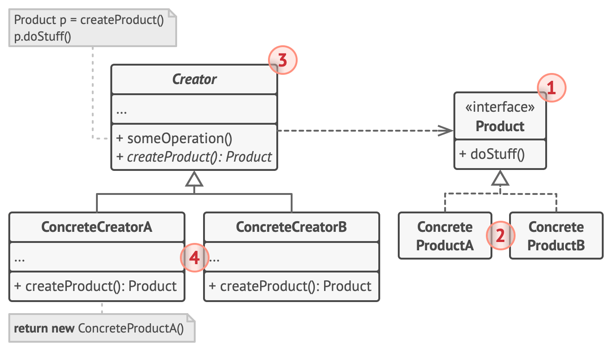
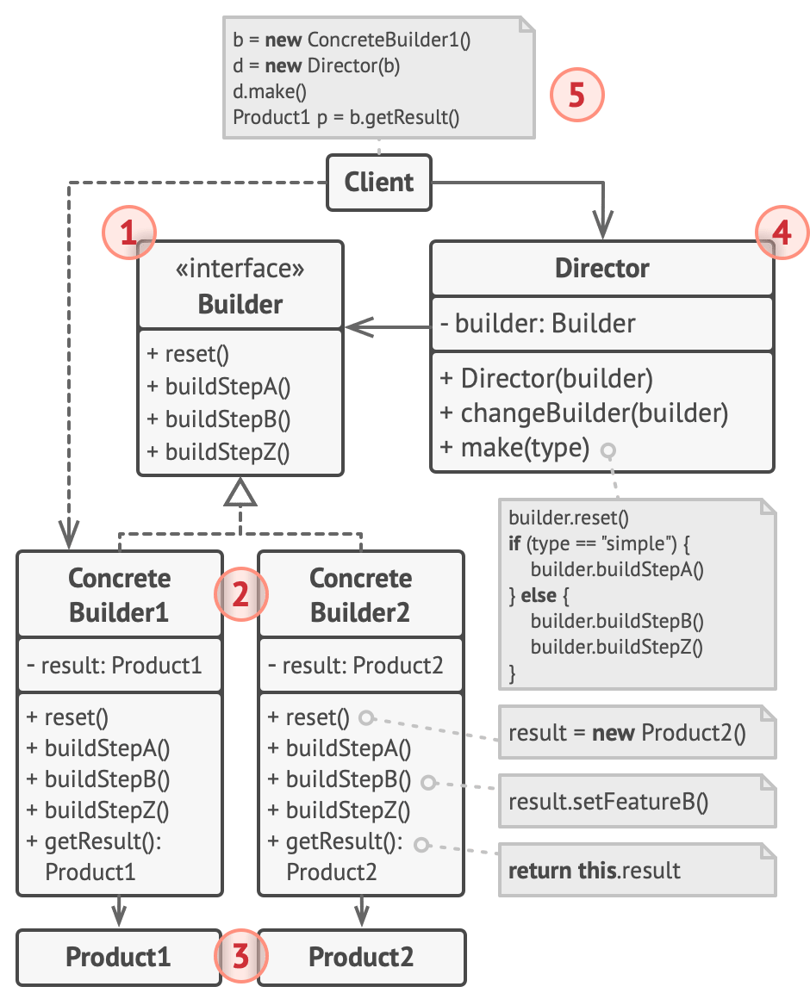
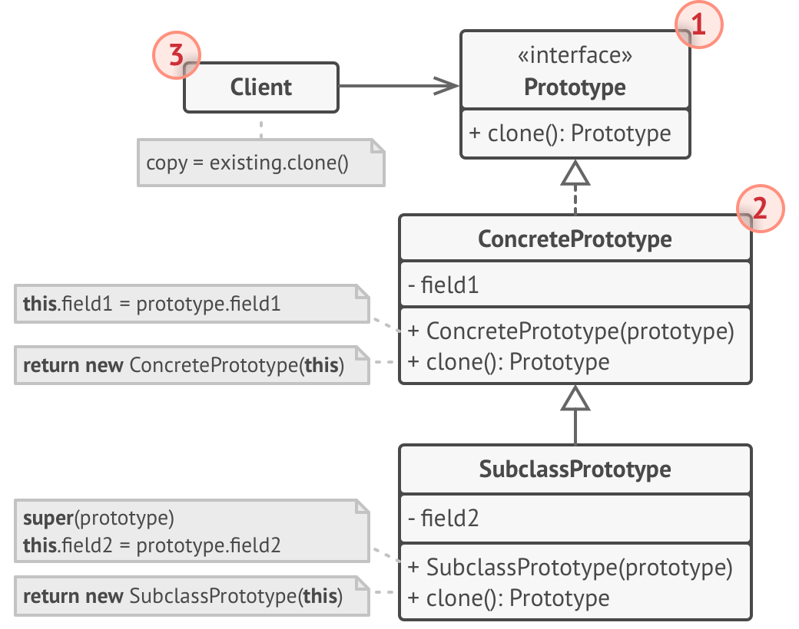

# Creational Design Patterns

[Factory Method](#-factory-method)
[Abstract Factory](#-abstract-factory)
[Builder](#-builder)
[Prototype](#-prototype)
[Singleton](#-Singleton)

`Creational` design patterns provide various object creation mechanisms, which increase flexibility and reuse of existing code.

## Factory Method

`Factory Method` polega na definiowaniu metody, która zwraca obiekt z określonej klasy, ale pozwala podklasom na decydowanie, którą klasę konkretnie utworzyć. Dzięki temu proces tworzenia obiektów jest oddzielony od ich implementacji. Oto kilka realnych przykładów zastosowania tego wzorca:

### Tworzenie Dokumentów w Edytorze Tekstu

W edytorach tekstu można mieć różne typy dokumentów (np. tekstowy, HTML, Markdown). Metoda fabrykująca może być używana do tworzenia odpowiedniego typu dokumentu na podstawie formatu wybranego przez użytkownika. Na przykład, jeśli użytkownik wybiera format HTML, metoda fabrykująca utworzy obiekt dokumentu HTML.

### Tworzenie Pojazdów w Grze Komputerowej

W grach komputerowych, gdzie można tworzyć różne typy pojazdów (np. samochody, motocykle, ciężarówki), metoda fabrykująca może być używana do tworzenia odpowiedniego typu pojazdu na podstawie wyboru gracza lub poziomu gry. Każdy typ pojazdu jest reprezentowany przez inną klasę, a metoda fabrykująca decyduje, który typ pojazdu utworzyć.

### Generowanie Raportów w Aplikacjach Biznesowych

W aplikacjach biznesowych można generować różne typy raportów (np. raporty sprzedaży, raporty finansowe, raporty zapasów). Metoda fabrykująca może być używana do tworzenia odpowiedniego typu raportu na podstawie wymagań użytkownika. Na przykład, metoda fabrykująca może utworzyć obiekt raportu sprzedaży, jeśli użytkownik zażąda raportu dotyczącego sprzedaży.

### Tworzenie Kont w Systemie Bankowym

W systemach bankowych można mieć różne typy kont (np. oszczędnościowe, bieżące, lokacyjne). Metoda fabrykująca może być używana do tworzenia odpowiedniego typu konta na podstawie wyboru klienta. Na przykład, jeśli klient wybiera konto oszczędnościowe, metoda fabrykująca utworzy obiekt konta oszczędnościowego.

### Tworzenie Okien w Aplikacjach GUI

W aplikacjach z interfejsem graficznym (GUI) można tworzyć różne typy okien (np. okna dialogowe, okna główne, okna pomocnicze). Metoda fabrykująca może być używana do tworzenia odpowiedniego typu okna na podstawie kontekstu aplikacji. Na przykład, metoda fabrykująca może utworzyć okno dialogowe, gdy aplikacja potrzebuje wyświetlić komunikat dla użytkownika.

## Abstract Factory

`Abstract Factory` zapewnia interfejs do tworzenia rodzin powiązanych lub zależnych obiektów bez określania ich konkretnych klas. Dzięki temu możliwe jest tworzenie zestawów powiązanych obiektów, które mogą współpracować ze sobą. Oto kilka realnych przykładów zastosowania tego wzorca:

### Tworzenie interfejsów użytkownika (UI)

W aplikacjach z interfejsem graficznym (GUI) można mieć różne zestawy komponentów UI (np. okna, przyciski, pola tekstowe) dla różnych systemów operacyjnych (np. Windows, macOS, Linux). Fabryka Abstrakcyjna może tworzyć odpowiednie komponenty UI w zależności od systemu operacyjnego, zapewniając spójny wygląd i działanie aplikacji na różnych platformach.

### Systemy bazodanowe

W aplikacjach korzystających z różnych systemów bazodanowych (np. MySQL, PostgreSQL, Oracle), Fabryka Abstrakcyjna może tworzyć zestawy obiektów do zarządzania połączeniami, zapytaniami i wynikami specyficznymi dla danego systemu bazodanowego. Dzięki temu aplikacja może być łatwo przenoszona pomiędzy różnymi bazami danych bez zmiany kodu logiki biznesowej.

### Konfiguracja gier komputerowych

W grach komputerowych można mieć różne zestawy obiektów reprezentujących postacie, poziomy, i przedmioty w zależności od trybu gry (np. tryb fantasy, tryb science fiction). Fabryka Abstrakcyjna może tworzyć odpowiednie zestawy obiektów dla każdego trybu, zapewniając spójność i łatwość rozszerzania gry o nowe tryby.

### Systemy płatności online

W aplikacjach e-commerce można korzystać z różnych metod płatności (np. karta kredytowa, PayPal, przelew bankowy). Fabryka Abstrakcyjna może tworzyć zestawy obiektów do obsługi każdej z metod płatności, takich jak procesory płatności, walidatory, i interfejsy użytkownika. Dzięki temu możliwe jest łatwe dodawanie nowych metod płatności bez zmiany istniejącego kodu.

### Systemy raportowania

W aplikacjach raportujących można generować różne typy raportów (np. raporty PDF, raporty Excel, raporty HTML). Fabryka Abstrakcyjna może tworzyć zestawy obiektów do generowania raportów w różnych formatach, zapewniając spójny interfejs do tworzenia raportów, niezależnie od formatu wyjściowego.

## Builder

`Builder` umożliwia tworzenie złożonych obiektów krok po kroku, oddzielając proces konstrukcji od reprezentacji. Pozwala to na tworzenie różnych reprezentacji tego samego obiektu przy użyciu tego samego procesu konstrukcji. Oto kilka realnych przykładów zastosowania tego wzorca:

### Tworzenie Domów

W systemach do projektowania architektonicznego można tworzyć różne typy domów (np. domy jednorodzinne, wille, bloki mieszkalne). Budowniczy może umożliwiać tworzenie tych różnych typów domów krok po kroku (np. budowa fundamentów, ścian, dachu), jednocześnie pozwalając na różne style i układy w zależności od spec`yfikacji klienta.

### Konfiguracja Samochodów

W aplikacjach do konfiguracji samochodów można tworzyć różne modele samochodów z różnymi opcjami (np. silnik, kolor, wyposażenie). Budowniczy może umożliwiać krok po kroku konfigurację samochodu, oferując różne komponenty i opcje, które mogą być `łączone w różne konfiguracje w zależności od wyborów klienta.

### Generowanie Dokumentów

W aplikacjach biurowych można tworzyć różne typy dokumentów (np. raporty, faktury, umowy). Budowniczy może umożliwiać tworzenie dokumentu krok po kroku (np. dodawanie nagłówka, sekcji, stopek), umożliwiając tworzenie różnych formatów i st`ylów dokumentów w zależności od potrzeb użytkownika.

### Tworzenie Posiłków

W systemach do zamawiania posiłków można tworzyć złożone zestawy posiłków (np. zestaw lunchowy, zestaw obiadowy). Budowniczy może umożliwiać tworzenie posiłków krok po kroku (np. wybór przystawki, dania głównego, deseru), pozwalając na różne komb`inacje składników i dań w zależności od preferencji klienta.

### Budowa Komputerów

W aplikacjach do budowy komputerów można tworzyć różne konfiguracje komputerów (np. komputer do gier, komputer biurowy, serwer). Budowniczy może umożliwiać składanie komputera krok po kroku (np. wybór procesora, pamięci RAM, dysku twardego), umożliwiając tworzenie różnych konfiguracji sprzętowych w zależności od wymagań użytkownika.

## Prototype

`Prototype` polega na tworzeniu nowych obiektów poprzez klonowanie istniejących obiektów (prototypów), zamiast tworzenia ich od zera. Umożliwia to szybkie tworzenie nowych instancji obiektów z określonymi właściwościami. Oto kilka realnych przykładów zastosowania tego wzorca:

### Tworzenie Postaci w Grze

W grach komputerowych można szybko tworzyć nowe postacie przez klonowanie istniejących postaci-prototypów. Na przykład, jeśli gra wymaga dużej liczby żołnierzy, można utworzyć prototyp żołnierza i klonować go, aby uzyskać wiele podobnych postaci o tych samych atrybutach.

### Generowanie Dokumentów

W aplikacjach biurowych można szybko tworzyć nowe dokumenty przez klonowanie istniejących szablonów dokumentów. Na przykład, jeśli użytkownik często tworzy raporty o podobnym układzie i stylu, można utworzyć prototyp raportu i klonować go, aby uzyskać nowe raporty o tych samych właściwościach.

### Tworzenie Elementów Graficznych

W aplikacjach do projektowania graficznego można szybko tworzyć nowe elementy graficzne przez klonowanie istniejących elementów-prototypów. Na przykład, jeśli projekt wymaga wielu podobnych ikon, można utworzyć prototyp ikony i klonować go, aby uzyskać wiele ikon o tych samych cechach.

### Tworzenie Konfiguracji Urządzeń

W systemach zarządzania urządzeniami można szybko tworzyć nowe konfiguracje urządzeń przez klonowanie istniejących konfiguracji-prototypów. Na przykład, jeśli firma ma standardową konfigurację komputerów dla swoich pracowników, można utworzyć prototyp tej konfiguracji i klonować go, aby szybko skonfigurować nowe komputery.

### Tworzenie Projektów w Zarządzaniu Projektami

W systemach zarządzania projektami można szybko tworzyć nowe projekty przez klonowanie istniejących projektów-prototypów. Na przykład, jeśli firma często realizuje projekty o podobnym zakresie i strukturze, można utworzyć prototyp projektu i klonować go, aby łatwo tworzyć nowe projekty o tych samych parametrach.

# Singleton

`Singleton` zapewnia, że klasa ma tylko jedną instancję i udostępnia globalny punkt dostępu do tej instancji. Oto kilka realnych przykładów zastosowania tego wzorca:

### Zarządzanie Połączeniem z Bazą Danych

W aplikacjach korzystających z baz danych, Singleton jest często używany do zarządzania połączeniem z bazą danych. Zapewnia to, że w całej aplikacji istnieje tylko jedno połączenie z bazą danych, co pomaga zapobiegać problemom związanym z wielokrotnymi połączeniami i zarządzaniem zasobami.

### Konfiguracja Systemu

W wielu aplikacjach istnieje potrzeba zarządzania globalną konfiguracją, która jest dostępna dla różnych części aplikacji. Singleton może być używany do zarządzania konfiguracją systemu, zapewniając, że wszystkie moduły aplikacji korzystają z tych samych ustawień.

### Logowanie

W systemach logowania, Singleton może być używany do zarządzania zapisywaniem logów. Umożliwia to centralne zarządzanie logowaniem, zapewniając, że wszystkie wiadomości logów są zapisywane przez jeden wspólny obiekt logujący.

### Cache Aplikacji

Singleton może być używany do zarządzania cache'em aplikacji, zapewniając dostęp do jednego, wspólnego zasobu cache. Dzięki temu różne części aplikacji mogą wspólnie korzystać z tych samych danych cache, co poprawia wydajność i spójność.

### Zarządzanie Sesjami

W aplikacjach internetowych Singleton może być używany do zarządzania sesjami użytkowników. Umożliwia to centralne zarządzanie informacjami o sesjach, co jest szczególnie przydatne w kontekście aplikacji o dużej skali, gdzie konieczne jest utrzymanie spójności sesji użytkowników.

