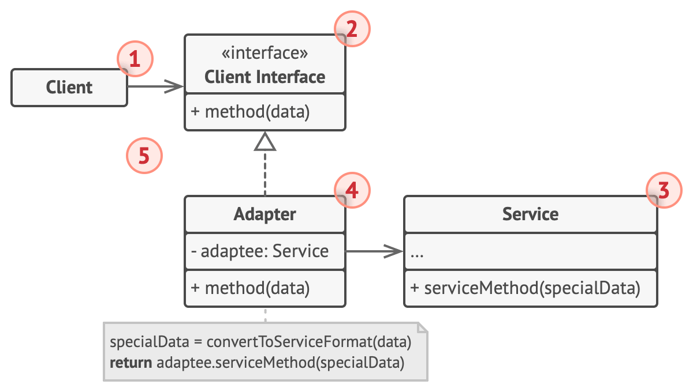
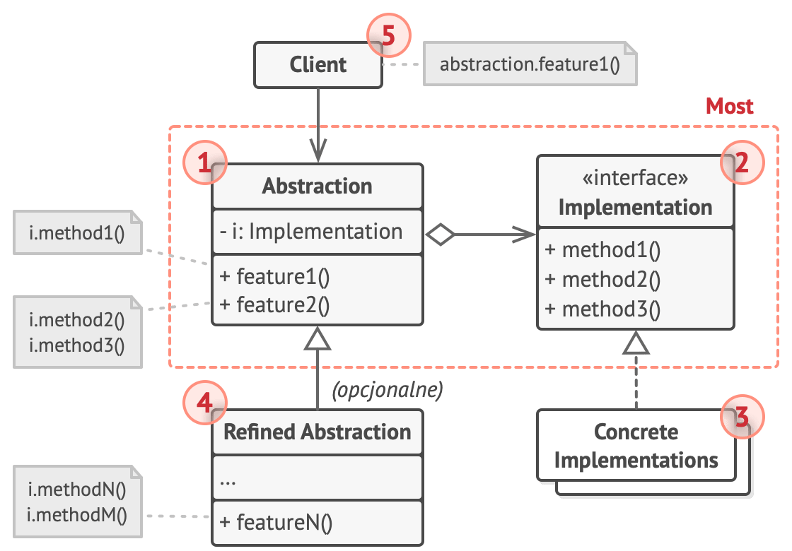
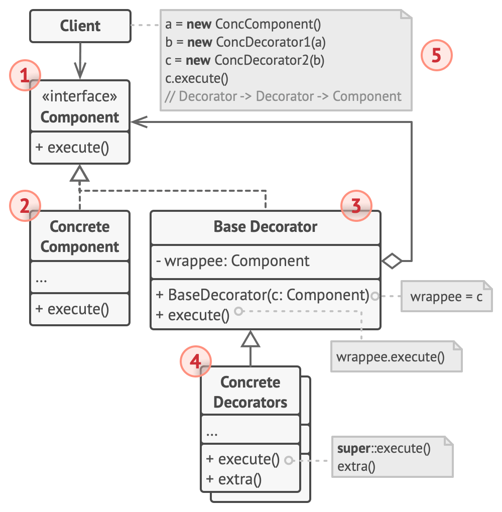
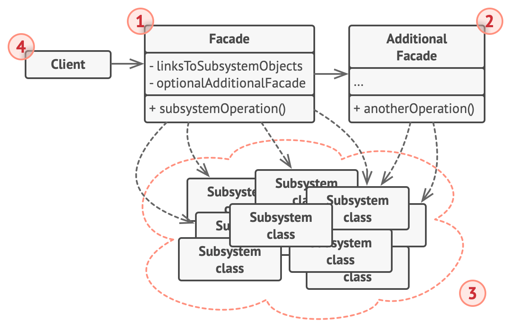
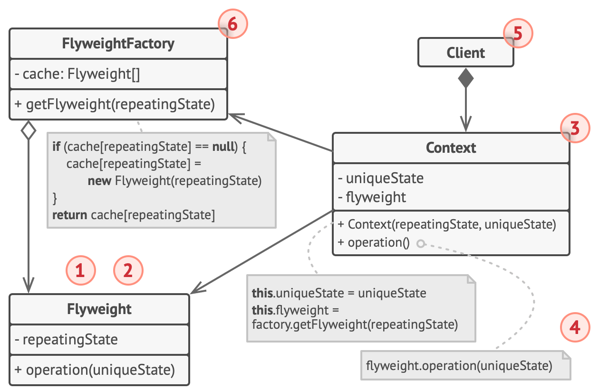
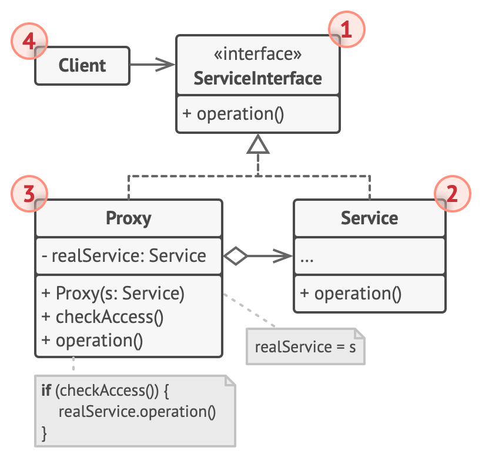

# Structural

[Adapter](#-adapter)

[Bridge](#-bridge)

[Composite](#-composite)

[Decorator](#-decorator)

[Facade](#-facade)

[Flyweight](#-flyweight)

[Proxy](#-proxy)

## Adapter

`Adapter` design pattern allows objects with incompatible interfaces to work together by transforming the interface of a class into another interface that clients expect. Here are several real-world examples of this pattern in use:

### Payment System Integration

In e-commerce applications, different payment systems (e.g., PayPal, Stripe, bank transfers) may have different interfaces. An Adapter can be used to transform the interface of each payment system into a common interface used by the application, enabling the handling of multiple payment methods without changing the business logic code.

### Communication with External APIs

In applications that need to communicate with various external APIs (e.g., weather services, social networks), the interfaces of these APIs can differ. An Adapter can be used to transform the external API interface into a format compatible with the internal interface of the application, facilitating easier integration with different services.

### Reading Data from Different Formats

In data analysis systems, data may come from different sources and be stored in various formats (e.g., CSV, JSON, XML). An Adapter can be used to transform these different data formats into a uniform internal format used by the data analysis system.

### Connecting Legacy Systems with New Ones

In enterprises, there is often a need to integrate legacy systems with new applications. An Adapter can be used to transform the interface of the legacy system into the interface expected by the new application, enabling both systems to work together.

### Device Control

In home automation systems, different devices may have different communication interfaces (e.g., Zigbee, Z-Wave, Wi-Fi). An Adapter can be used to transform the interface of each device into a common interface used by the home automation controller, allowing centralized control of all devices.

## Bridge

`Bridge` design pattern separates an abstraction from its implementation, allowing both to vary independently. This is particularly useful when both the abstraction and its implementation can be extended through inheritance. Here are several real-world examples of this pattern in use:

### Graphics Systems

In graphics applications, there can be different rendering formats (e.g., bitmap, vector) and various operating systems on which these formats can be displayed (e.g., Windows, macOS, Linux). The "Bridge" pattern allows for the separation of the code responsible for drawing graphics from the code that interacts with the operating system, enabling easy addition of new rendering formats and support for different operating systems.

### File Management Systems

In file management systems, there can be different types of file operations (e.g., copying, moving, deleting) and different file systems (e.g., FAT, NTFS, ext4). The "Bridge" pattern allows for the separation of file operation logic from the specific implementation of the file system, making it easy to add new operations and support different file systems.

### Device Control

In home automation systems, there can be different types of devices (e.g., lights, thermostats, locks) and different communication protocols (e.g., Zigbee, Z-Wave, Wi-Fi). The "Bridge" pattern allows for the separation of device control logic from the specific implementation of the communication protocol, enabling easy addition of new device types and support for various protocols.

### User Interfaces

In applications with user interfaces, there can be different ways to present data (e.g., list, grid) and different data sources (e.g., database, API, XML files). The "Bridge" pattern allows for the separation of data presentation logic from the specific implementation of the data source, making it easy to add new presentation methods and support various data sources.

### Payment Systems

In online payment systems, there can be different payment methods (e.g., credit cards, PayPal, cryptocurrencies) and different payment gateways (e.g., Stripe, Square, Authorize.net). The "Bridge" pattern allows for the separation of payment processing logic from the specific implementation of the payment gateway, enabling easy addition of new payment methods and support for various gateways.

## Composite

`Composite` design pattern allows individual objects and compositions of objects to be treated uniformly. This enables the creation of tree structures where both single objects and groups of objects can be treated in the same way. Here are several real-world examples of this pattern in use:

### File Systems

In file systems, files and directories can be treated uniformly. Directories can contain both files and other directories. Using the "Composite" pattern, operations such as searching or displaying contents can be performed uniformly for both files and directories.

### User Interfaces

In graphical user interface systems, components such as buttons, dialog boxes, and panels can be treated uniformly. Panels can contain other components, including other panels. The "Composite" pattern allows for uniform management of the user interface component hierarchy.

### Organizational Hierarchies

In company organizational structures, employees can be treated uniformly regardless of their position. For example, managers can have other employees reporting to them, including other managers. Using the "Composite" pattern, it is easy to manage the organizational structure and perform operations on all employees uniformly.

### Text Documents

In text editors, documents can consist of various elements such as paragraphs, sentences, and words. Each of these elements can be treated uniformly, allowing for uniform processing and manipulation of the document structure. The "Composite" pattern makes it easy to manage complex text documents.

### 3D Graphics Scenes

In 3D graphics, scenes can consist of various objects such as models, lights, and cameras. Each of these objects can be treated uniformly, and complex scenes can contain hierarchical structures of objects. Using the "Composite" pattern, it is easy to manage complex 3D scenes and perform operations on all objects uniformly.

## Decorator

`Decorator` design pattern allows for dynamically adding new functionalities to objects without modifying their code. It provides a flexible way to extend the capabilities of objects. Here are several real-world examples of this pattern in use:

### Decorating User Interface Components

In graphical user interface systems, various decorations such as borders, shadows, or scrollbars can be dynamically added to components (e.g., buttons, text fields). The "Decorator" pattern allows for adding these features dynamically without changing the base component's code.

### Extending Input/Output Stream Functions

In libraries handling input/output streams (e.g., in Java, .NET), new functionalities such as buffering, compression, or encryption can be dynamically added to streams. The "Decorator" pattern enables adding these features to existing streams without modifying their implementation.

### Extending Game Object Functionalities

In computer games, new attributes can be dynamically added to characters, such as armor, weapons, or abilities. The "Decorator" pattern allows for adding these features to existing character objects dynamically without changing their base code.

### Dynamically Modifying Web Services Behavior

In web services, new features such as logging, validation, or monitoring can be dynamically added to services. The "Decorator" pattern allows for adding these functionalities to existing services dynamically without changing their base code.

### Text Formatting

In text editing applications, various formats (e.g., bold, italic, underline) can be dynamically added to text. The "Decorator" pattern allows for adding these formats to existing text dynamically without modifying its base code.

## Facade

`Facade`

## Flyweight

## Proxy

`Proxy` design pattern provides a surrogate or placeholder object that controls access to another object. It allows adding additional functionalities such as access control, lazy loading, logging, etc. Here are several real-world examples of this pattern in use:

### Remote Proxy

In distributed applications, a remote proxy controls access to an object located on a remote server. The client communicates with the proxy, which forwards requests to the actual object on the server. This allows the client to work as if the object were local.

### Virtual Proxy

In applications dealing with large objects that are expensive to create and store (e.g., large images, complex documents), a virtual proxy delays the creation of the actual object until it is actually needed. The proxy holds information necessary for creating the object and creates it on demand.

### Protection Proxy

In systems requiring access control to objects (e.g., sensitive data, system resources), a protection proxy verifies whether the client has the necessary permissions to perform specific operations on the object. The proxy may deny access or forward requests to the real object only if the client meets certain criteria.

### Smart Proxy

In applications needing additional functionalities such as logging, reference counting, or managing access rights, a smart proxy adds these features before forwarding the request to the real object. This allows additional functionalities to be implemented without modifying the real object's code.

### Caching Proxy

In applications frequently accessing the same data (e.g., database records, computation results), a caching proxy stores the results of previous requests and returns them instead of recomputing or fetching them again. The proxy manages the cache, checking if stored results are up-to-date and removing outdated data.

