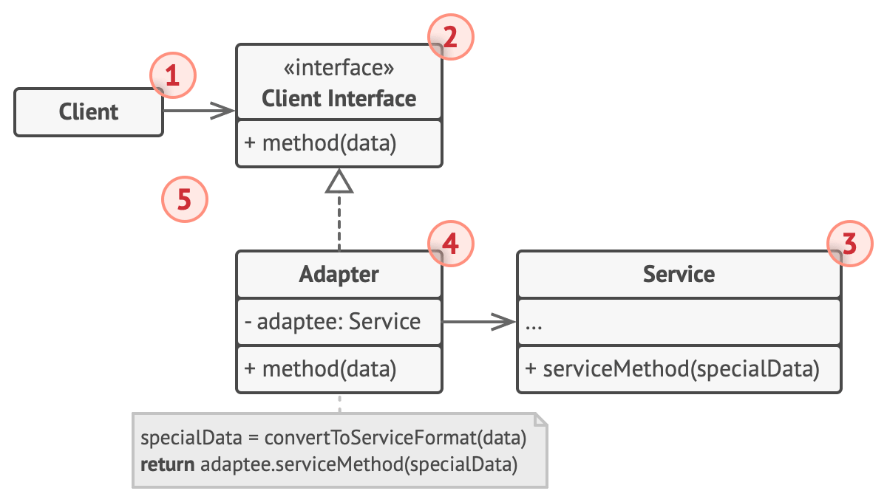
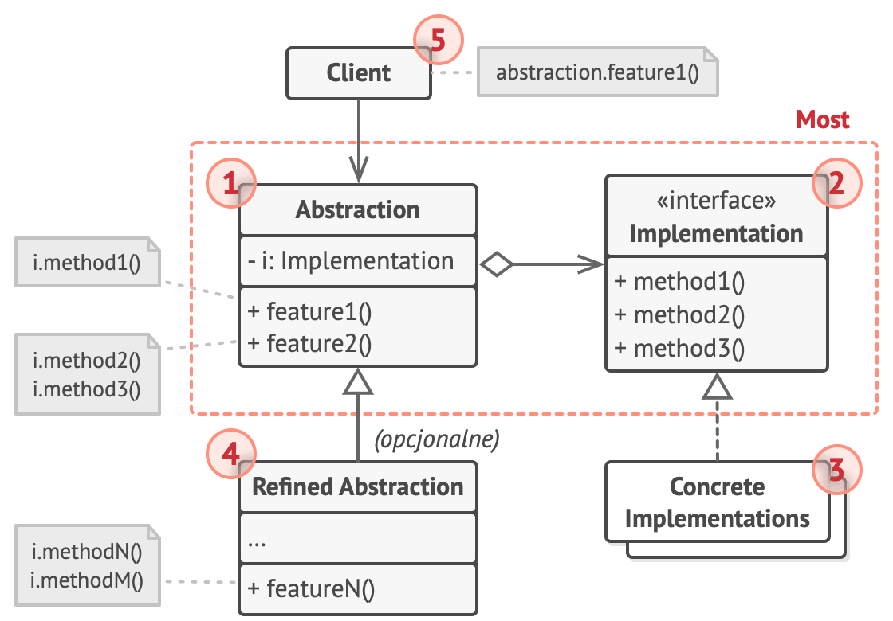
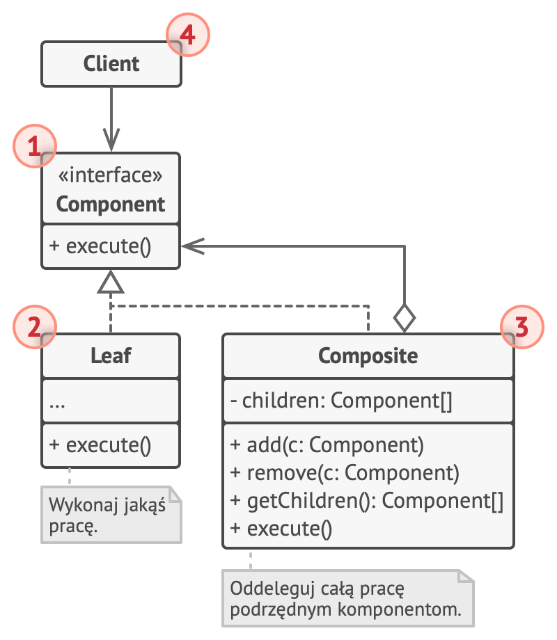
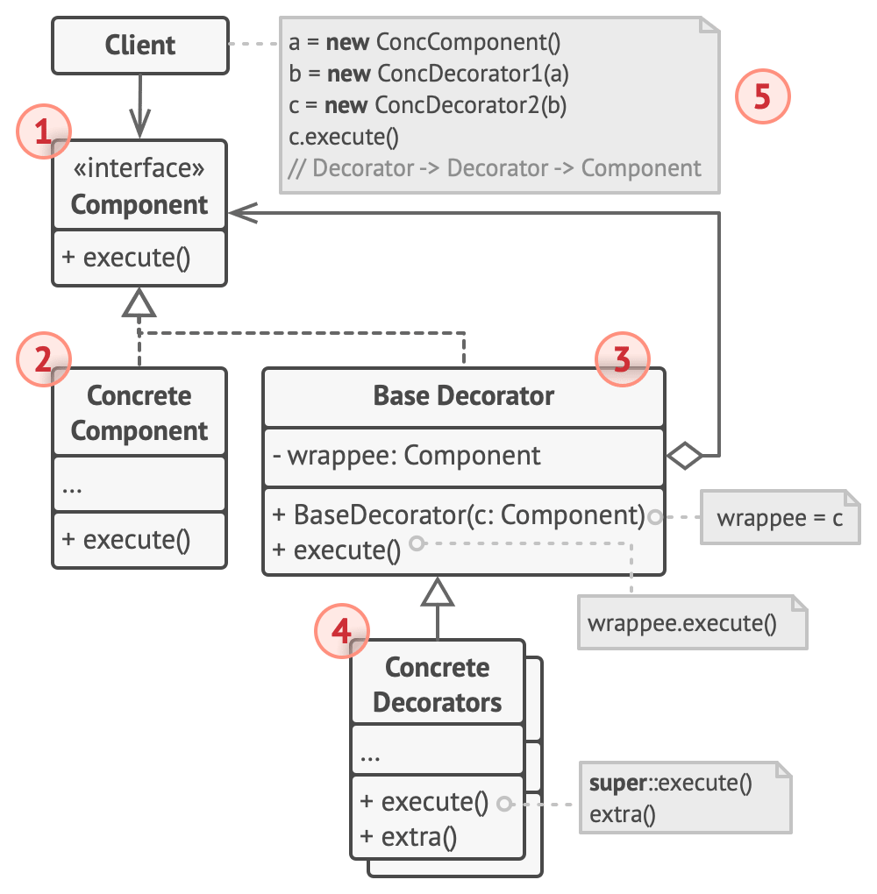
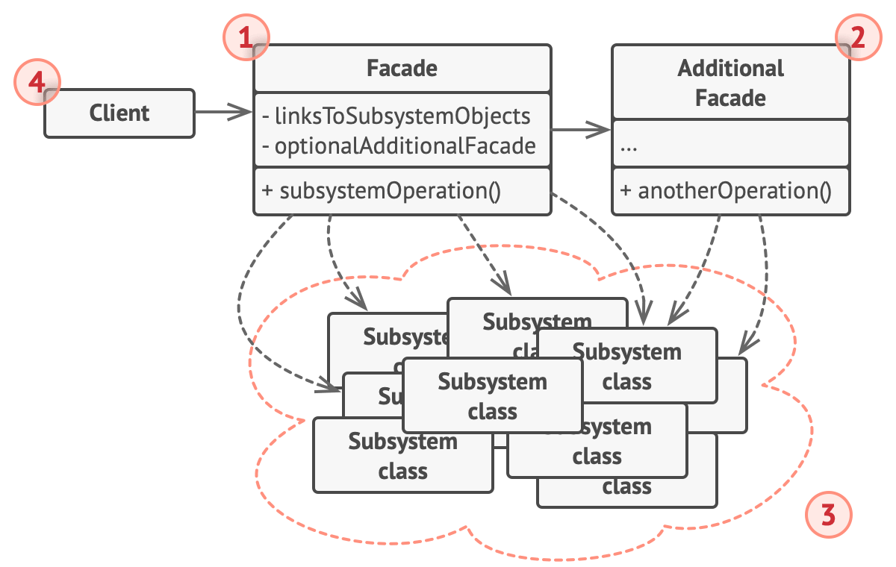
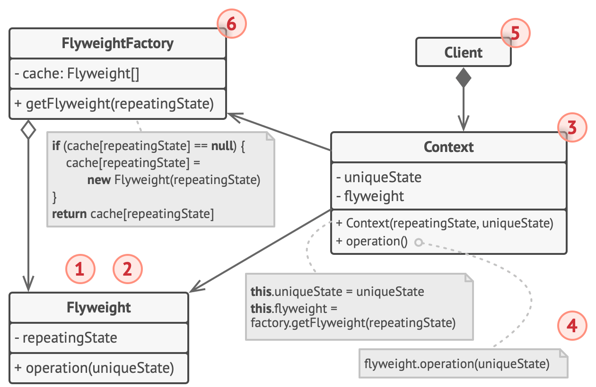
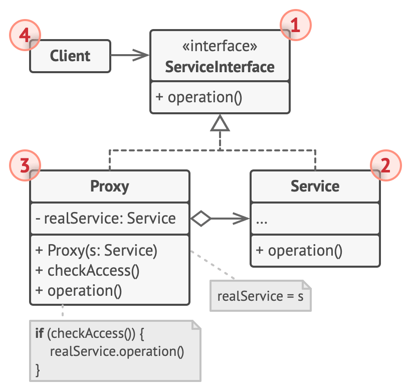

# Structural

[Adapter](#-adapter)

[Bridge](#-bridge)

[Composite](#-composite)

[Decorator](#-decorator)

[Facade](#-facade)

[Flyweight](#-flyweight)

[Proxy](#-proxy)

## Adapter

`Adapter` pozwala na współpracę obiektów o niezgodnych interfejsach, przekształcając interfejs klasy na inny, oczekiwany przez klienta. Oto kilka realnych przykładów zastosowania tego wzorca:

### Integracja Systemów Płatności

W aplikacjach e-commerce, różne systemy płatności (np. PayPal, Stripe, przelewy bankowe) mogą mieć różne interfejsy. Adapter może być użyty do przekształcenia interfejsu każdego systemu płatności na wspólny interfejs używany przez aplikację, umożliwiając obsługę wielu metod płatności bez zmiany kodu logiki biznesowej.

### Komunikacja z Zewnętrznymi API

W aplikacjach, które muszą komunikować się z różnymi zewnętrznymi API (np. usługi pogodowe, serwisy społecznościowe), interfejsy tych API mogą się różnić. Adapter może być użyty do przekształcenia interfejsu zewnętrznego API na format, który jest zgodny z wewnętrznym interfejsem aplikacji, umożliwiając łatwiejszą integrację z różnymi usługami.

### Odczytywanie Danych z Różnych Formatów

W systemach analizy danych, dane mogą pochodzić z różnych źródeł i być zapisane w różnych formatach (np. CSV, JSON, XML). Adapter może być użyty do przekształcenia różnych formatów danych na jednolity format wewnętrzny używany przez system analizy danych.

### Łączenie Starszych Systemów z Nowymi

W przedsiębiorstwach często istnieje potrzeba integracji starszych systemów (legacy systems) z nowymi aplikacjami. Adapter może być użyty do przekształcenia interfejsu starszego systemu na interfejs oczekiwany przez nową aplikację, umożliwiając współpracę obu systemów.

### Sterowanie Urządzeniami

W systemach automatyki domowej różne urządzenia mogą mieć różne interfejsy komunikacyjne (np. urządzenia Zigbee, Z-Wave, Wi-Fi). Adapter może być użyty do przekształcenia interfejsu każdego urządzenia na wspólny interfejs kontrolera automatyki domowej, umożliwiając centralne sterowanie wszystkimi urządzeniami.

## Bridge

`Bridge` oddziela abstrakcję od jej implementacji, dzięki czemu obie mogą zmieniać się niezależnie od siebie. Jest to szczególnie przydatne, gdy zarówno abstrakcja, jak i jej implementacja mogą być rozszerzane przez dziedziczenie. Oto kilka realnych przykładów zastosowania tego wzorca:

### Systemy Grafiki

W aplikacjach graficznych można mieć różne formaty wyświetlania (np. bitmapy, wektory) oraz różne systemy operacyjne, na których te formaty mogą być wyświetlane (np. Windows, macOS, Linux). Wzorzec "Bridge" pozwala na oddzielenie kodu odpowiedzialnego za rysowanie grafiki od kodu odpowiedzialnego za interakcję z systemem operacyjnym, umożliwiając łatwe dodawanie nowych formatów wyświetlania i wspieranie różnych systemów operacyjnych.

### Systemy Zarządzania Plikami

W systemach zarządzania plikami można mieć różne typy operacji na plikach (np. kopiowanie, przenoszenie, usuwanie) oraz różne systemy plików (np. FAT, NTFS, ext4). Wzorzec "Bridge" pozwala na oddzielenie operacji na plikach od konkretnej implementacji systemu plików, co umożliwia łatwe dodawanie nowych operacji i wspieranie różnych systemów plików.

### Sterowanie Urządzeniami

W systemach automatyki domowej można mieć różne typy urządzeń (np. lampy, termostaty, zamki) oraz różne protokoły komunikacyjne (np. Zigbee, Z-Wave, Wi-Fi). Wzorzec "Bridge" pozwala na oddzielenie logiki sterowania urządzeniami od konkretnej implementacji protokołu komunikacyjnego, umożliwiając łatwe dodawanie nowych typów urządzeń i wspieranie różnych protokołów.

### Interfejsy Użytkownika

W aplikacjach z interfejsem użytkownika można mieć różne sposoby prezentacji danych (np. lista, siatka) oraz różne źródła danych (np. baza danych, API, pliki XML). Wzorzec "Bridge" pozwala na oddzielenie logiki prezentacji danych od konkretnej implementacji źródła danych, co umożliwia łatwe dodawanie nowych sposobów prezentacji i wspieranie różnych źródeł danych.

### Systemy Płatności

W systemach płatności online można mieć różne metody płatności (np. karty kredytowe, PayPal, kryptowaluty) oraz różne bramki płatności (np. Stripe, Square, Authorize.net). Wzorzec "Bridge" pozwala na oddzielenie logiki obsługi płatności od konkretnej implementacji bramki płatności, umożliwiając łatwe dodawanie nowych metod płatności i wspieranie różnych bramek płatności.

## Composite

`Composite` umożliwia traktowanie obiektów indywidualnych oraz ich kompozycji jednolicie. Umożliwia to tworzenie struktury drzewiastej, gdzie zarówno obiekty pojedyncze, jak i ich grupy mogą być traktowane w ten sam sposób. Oto kilka realnych przykładów zastosowania tego wzorca:

### Systemy Plików

W systemach plików pliki i katalogi mogą być traktowane jednolicie. Katalogi mogą zawierać zarówno pliki, jak i inne katalogi. Dzięki wzorcowi "Composite" operacje takie jak przeszukiwanie czy wyświetlanie zawartości mogą być realizowane w sposób jednolity dla plików i katalogów.

### Interfejsy Użytkownika

W systemach graficznych interfejsów użytkownika, komponenty takie jak przyciski, okna dialogowe i panele mogą być traktowane jednolicie. Panele mogą zawierać inne komponenty, w tym również inne panele. Wzorzec "Composite" umożliwia jednolite zarządzanie hierarchią komponentów interfejsu użytkownika.

### Organizacje Hierarchiczne

W strukturach organizacyjnych firm pracownicy mogą być traktowani jednolicie, niezależnie od ich pozycji. Na przykład, menedżerowie mogą mieć pod sobą innych pracowników, w tym również innych menedżerów. Dzięki wzorcowi "Composite" można łatwo zarządzać strukturą organizacyjną i wykonywać operacje na wszystkich pracownikach w jednolity sposób.

### Dokumenty Tekstowe

W edytorach tekstu dokumenty mogą składać się z różnych elementów, takich jak paragrafy, zdania i słowa. Każdy z tych elementów może być traktowany jednolicie, co umożliwia jednolite przetwarzanie i manipulowanie strukturą dokumentu. Wzorzec "Composite" pozwala na łatwe zarządzanie złożonymi dokumentami tekstowymi.

### Sceny w Grafice 3D

W grafice 3D sceny mogą składać się z różnych obiektów, takich jak modele, światła i kamery. Każdy z tych obiektów może być traktowany jednolicie, a złożone sceny mogą zawierać hierarchiczne struktury obiektów. Dzięki wzorcowi "Composite" można łatwo zarządzać skomplikowanymi scenami 3D i wykonywać operacje na wszystkich obiektach w jednolity sposób.

## Decorator

`Decorator` umożliwia dynamiczne dodawanie nowych funkcji do obiektów bez konieczności modyfikowania ich kodu. Pozwala to na elastyczne rozszerzanie możliwości obiektów. Oto kilka realnych przykładów zastosowania tego wzorca:

### Dekorowanie Komponentów Interfejsu Użytkownika

W systemach graficznych interfejsów użytkownika różne dekoracje, takie jak ramki, cienie, czy przewijanie, mogą być dynamicznie dodawane do komponentów (np. przycisków, pól tekstowych). Wzorzec "Dekorator" pozwala na dodawanie tych funkcji w sposób dynamiczny bez potrzeby zmiany kodu bazowego komponentu.

### Rozszerzanie Funkcji Strumieni Wejścia/Wyjścia

W bibliotekach obsługujących strumienie wejścia/wyjścia (np. w Java, .NET) można dynamicznie dodawać nowe funkcje do strumieni, takie jak buforowanie, kompresja czy szyfrowanie. Wzorzec "Dekorator" umożliwia dodawanie tych funkcji do istniejących strumieni bez konieczności modyfikowania ich implementacji.

### Rozszerzanie Funkcjonalności Obiektów w Grze

W grach komputerowych można dynamicznie dodawać nowe cechy do postaci, takie jak zbroja, bronie, czy umiejętności. Wzorzec "Dekorator" pozwala na dodawanie tych cech do istniejących obiektów postaci w sposób dynamiczny, bez potrzeby modyfikowania ich kodu bazowego.

### Dynamiczne Modyfikowanie Zachowań Serwisów Internetowych

W serwisach internetowych można dynamicznie dodawać nowe funkcje do usług, takie jak logowanie, walidacja, czy monitorowanie. Wzorzec "Dekorator" umożliwia dodawanie tych funkcji do istniejących usług w sposób dynamiczny, bez potrzeby zmiany ich kodu bazowego.

### Formatowanie Tekstu

W aplikacjach do edycji tekstu różne formaty (np. pogrubienie, kursywa, podkreślenie) mogą być dynamicznie dodawane do tekstu. Wzorzec "Dekorator" pozwala na dodawanie tych formatów do istniejącego tekstu w sposób dynamiczny, bez potrzeby modyfikowania jego kodu bazowego.

## Facade

`Facade`

## Flyweight

## Proxy

`Proxy` umożliwia utworzenie obiektu zastępczego, który kontroluje dostęp do innego obiektu. Proxy może dodać dodatkowe funkcjonalności, takie jak kontrola dostępu, opóźnione ładowanie, logowanie, itp. Oto kilka realnych przykładów zastosowania tego wzorca:

### Zdalny Proxy (Remote Proxy)

W aplikacjach rozproszonych, zdalny proxy kontroluje dostęp do obiektu znajdującego się na serwerze zdalnym. Klient komunikuje się z proxy, które następnie przekazuje żądania do rzeczywistego obiektu na serwerze. Dzięki temu klient może pracować tak, jakby obiekt znajdował się lokalnie.

### Wirtualny Proxy (Virtual Proxy)

W aplikacjach, które korzystają z dużych obiektów, które mogą być kosztowne w tworzeniu i pamięci (np. duże obrazy, złożone dokumenty), wirtualny proxy opóźnia tworzenie rzeczywistego obiektu, dopóki nie jest on rzeczywiście potrzebny. Proxy przechowuje informacje niezbędne do stworzenia obiektu i tworzy go na żądanie.

### Zabezpieczający Proxy (Protection Proxy)

W systemach, gdzie potrzebna jest kontrola dostępu do obiektów (np. wrażliwe dane, zasoby systemowe), zabezpieczający proxy sprawdza, czy klient ma odpowiednie uprawnienia do wykonania określonych operacji na obiekcie. Proxy może odmówić dostępu lub przekierować żądania do rzeczywistego obiektu tylko wtedy, gdy klient spełnia określone kryteria.

### Inteligentny Proxy (Smart Proxy)

W aplikacjach, które wymagają dodatkowej funkcjonalności, takiej jak logowanie, śledzenie liczby odwołań czy zarządzanie blokadami, inteligentny proxy dodaje te funkcje przed przekazaniem żądania do rzeczywistego obiektu. Dzięki temu dodatkowe funkcjonalności są realizowane bez modyfikacji kodu rzeczywistego obiektu.

### Caching Proxy

W aplikacjach, które często pobierają te same dane (np. dane z baz danych, wyniki obliczeń), caching proxy przechowuje wyniki wcześniejszych żądań i zwraca je zamiast ponownie wykonywać kosztowne operacje. Proxy zarządza pamięcią podręczną, sprawdzając, czy przechowywane wyniki są aktualne i usuwa przestarzałe dane.

