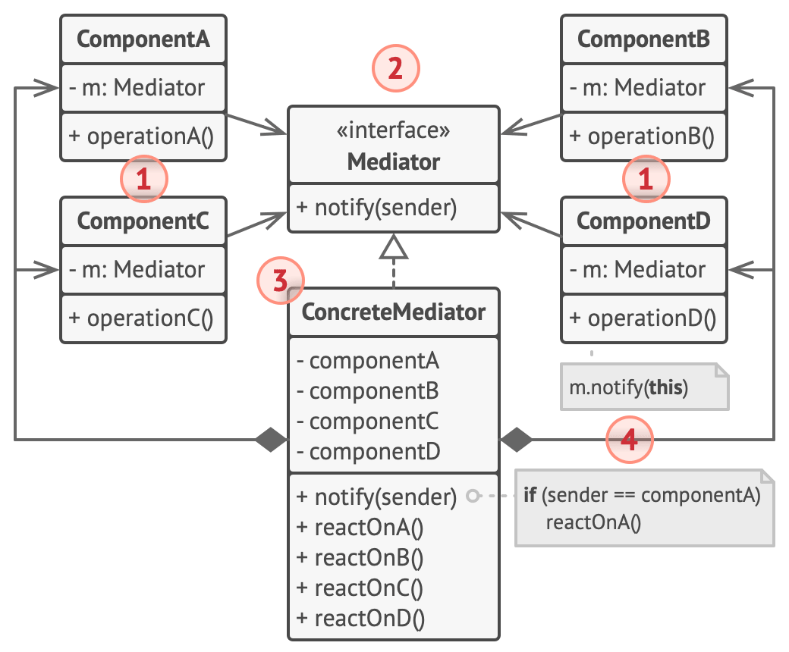

# Behavioral patterns

## Chain of Responsibility

### Help Desk Ticketing System

In a help desk ticketing system, a user's problem report is passed through various levels of technical support. The first level handles basic issues, and if it cannot resolve the ticket, it forwards it to the second level of support, and so on, until the problem is resolved.

### Event Logging

In a logging system, various modules can process log events at different levels (e.g., DEBUG, INFO, WARN, ERROR). A log event is passed through a chain of loggers, with each deciding whether to log the event or pass it on.

### Request Processing in Web Applications

In web applications, HTTP requests are often processed by a chain of filters or middleware. Each filter can process the request (e.g., authentication, authorization, data validation) and decide whether to pass it to the next filter or to stop processing.

### Command Handling in Software

In applications that interpret user commands (e.g., text editors, graphic software), each command is passed through a chain of objects that handle different types of commands. Each object checks if it can handle the given command and, if not, passes it to the next object in the chain.

### Request Authorization in Security Systems

In security systems, access requests to resources are passed through a chain of authorization policies. Each policy checks if it meets certain authorization criteria and, if so, grants access. If not, the request is passed to the next policy in the chain.

## Command

The "Command" design pattern involves encapsulating a request as an object, allowing clients to be parameterized with different requests, queue or log requests, and support undoable operations. Here are several real-world examples of this pattern in use:

### Undo/Redo Operations in Text Editors

In text editors, each user action (e.g., typing text, deleting text, changing formatting) is encapsulated as a Command object. This allows for easy undo and redo operations because the history of executed commands can be stored.

### Order Processing in Transaction Systems

In transaction systems, each transaction (e.g., bank transfer, online purchase) is encapsulated as a Command object. This facilitates managing transactions, ensuring their reliability, and implementing retry mechanisms in case of failure.

### Macros in Software Applications

In applications that allow macro creation, a series of commands executed by the user is recorded as a sequence of Command objects. This enables replaying macros to automate tasks, increasing the user's efficiency.

### UI Control in Desktop Applications

In desktop applications, actions triggered by the user interface (e.g., button clicks, menu selections) are represented as Command objects. This simplifies managing actions, allows dynamically assigning commands to UI elements, and supports undo/redo functionality.

### Task Management in Queueing Systems

In queueing systems, each task (e.g., file processing, sending an email) is represented as a Command object. This facilitates easy queuing, prioritizing, and retrying tasks, ensuring flexible and reliable processing.

## Iterator

The "Iterator" design pattern allows for sequential access to elements of a collection without exposing its internal structure. Here are several real-world examples of this pattern in use:

### Browsing a List of Files in a File Manager

In a file manager, a user can browse through a list of files and folders. An iterator is used to traverse the elements of the list, enabling the user to navigate without needing to know the internal structure of the data.

### Visiting Nodes in an XML Tree

When processing an XML document, an iterator can be used to visit the nodes of the XML tree. This allows for sequentially browsing elements without delving into the details of the tree structure.

### Traversing a Collection of Objects in E-commerce Applications

In e-commerce applications, a list of products can be browsed using an iterator. This allows the user to sequentially view available products, regardless of how the list is internally implemented.

### Navigating through GUI Elements in Desktop Applications

In desktop applications, an iterator can be used to traverse GUI elements, such as buttons, text fields, and other controls. This allows operations on these elements in a uniform manner without revealing implementation details.

### Iterating Through Query Results in a Database

After executing a query in a database, an iterator can be used to traverse the query results. This allows for sequential processing of each result without needing to know the details of data storage and structure in the database.

## Mediator

The "Mediator" design pattern defines an object that encapsulates how a set of objects interact. This pattern promotes loose coupling by preventing direct communication between objects, allowing for independent changes in their interactions. Here are several real-world examples of this pattern in use:

### Managing Interactions in User Interfaces

In applications with complex user interfaces (e.g., forms with multiple fields and buttons), a mediator can manage interactions between UI elements. For example, a change in one field may affect another field or button. The mediator facilitates these interactions, simplifying logic and reducing dependencies between components.

### Chat Systems

In chat applications, a mediator can manage communication between users. Instead of users communicating directly with each other, each user sends messages to the mediator, which then forwards them to the appropriate recipients. This makes it easier to manage multiple simultaneous conversations and add new features (e.g., content filtering).

### Air Traffic Control

In air traffic control systems, the mediator (air traffic controller) coordinates communication between aircraft. Instead of aircraft communicating directly with each other, all messages go through the air traffic controller, who manages landings, take-offs, and air traffic flow, preventing collisions and optimizing traffic.

### Managing Modules in Modular Applications

In applications composed of many independent modules, a mediator can manage interactions between these modules. For example, in an ERP system, different modules (accounting, inventory management, sales) can communicate through the mediator, which coordinates their actions and data exchange.

### Telephone Switchboard

In traditional telephone switchboards, the mediator (switchboard) facilitates connections between subscribers. Instead of subscribers connecting directly, the switchboard routes calls, managing communication and enabling additional features like call forwarding and conferencing.

