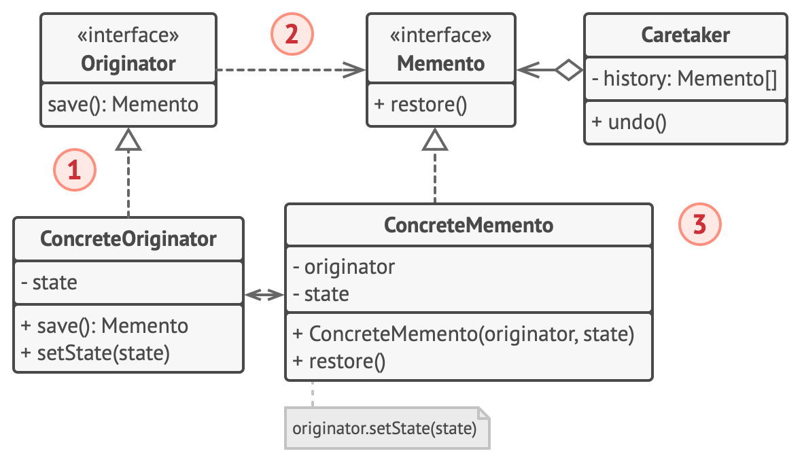
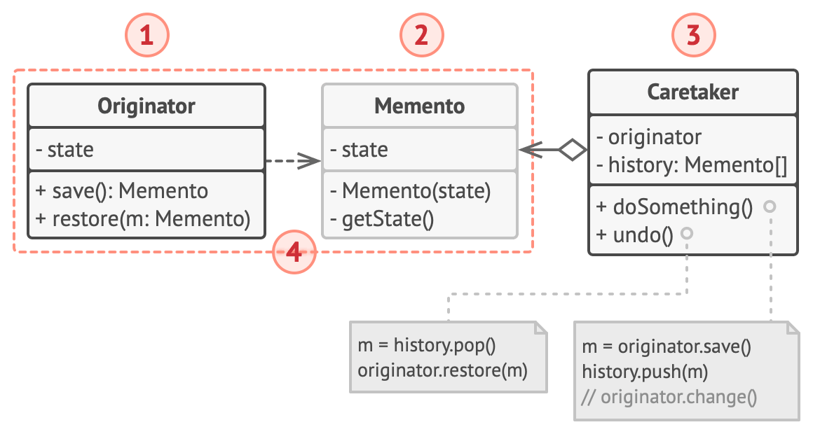

# Behavioral patterns

## Chain of Responsibility

Wzorzec projektowy "Chain of Responsibility" polega na przekazywaniu żądań przez łańcuch odbiorców, aż jedno z nich obsłuży żądanie. Oto kilka realnych przykładów zastosowania tego wzorca:

### System Obsługi Zgłoszeń (Help Desk)

W systemie obsługi zgłoszeń, zgłoszenie problemu od użytkownika jest przekazywane przez różne poziomy wsparcia technicznego. Pierwszy poziom obsługuje podstawowe problemy, a jeśli nie jest w stanie rozwiązać zgłoszenia, przekazuje je do drugiego poziomu wsparcia, i tak dalej, aż problem zostanie rozwiązany.

### Logowanie Zdarzeń (Logging)

W systemie logowania, różne moduły mogą przetwarzać zdarzenia logowania na różnych poziomach (np. DEBUG, INFO, WARN, ERROR). Zdarzenie logowania jest przekazywane przez łańcuch loggerów, a każdy z nich decyduje, czy logować zdarzenie, czy przekazać je dalej.

### Przetwarzanie Żądań w Aplikacjach Webowych

W aplikacjach webowych, żądania HTTP są często przetwarzane przez łańcuch filtrów lub middleware. Każdy filtr może przetwarzać żądanie (np. uwierzytelnienie, autoryzacja, walidacja danych) i decydować, czy przekazać je do następnego filtra, czy zakończyć przetwarzanie.

### Obsługa Poleceń w Oprogramowaniu

W aplikacjach, które interpretują polecenia użytkownika (np. edytory tekstu, aplikacje graficzne), każde polecenie jest przekazywane przez łańcuch obiektów obsługujących różne typy poleceń. Każdy obiekt sprawdza, czy może obsłużyć dane polecenie, i jeśli nie, przekazuje je do następnego obiektu w łańcuchu.

### Autoryzacja Żądań w Systemach Bezpieczeństwa

W systemach bezpieczeństwa, żądania dostępu do zasobów są przekazywane przez łańcuch polityk autoryzacyjnych. Każda polityka sprawdza, czy spełnia określone kryteria autoryzacji, i jeśli tak, przyznaje dostęp. Jeśli nie, żądanie jest przekazywane do następnej polityki w łańcuchu.

## Command

Wzorzec projektowy "Command" polega na enkapsulacji żądania jako obiektu, co pozwala na parametryzowanie klientów różnymi żądaniami, kolejkowanie lub logowanie żądań oraz obsługę operacji undo. Oto kilka realnych przykładów zastosowania tego wzorca:

### Operacje Undo/Redo w Edytorach Tekstu

W edytorach tekstu, każda akcja użytkownika (np. wpisanie tekstu, usunięcie tekstu, zmiana formatowania) jest enkapsulowana jako obiekt Command. Pozwala to na łatwe cofanie i ponawianie operacji, ponieważ można przechowywać historię wykonanych poleceń.

### Obsługa Zleceń w Systemach Transakcyjnych

W systemach transakcyjnych, każda transakcja (np. przelew bankowy, zakupy online) jest enkapsulowana jako obiekt Command. Dzięki temu można łatwo zarządzać transakcjami, zapewniając ich niezawodność, a także implementować mechanizmy powtórzeń w przypadku niepowodzenia.

### Makra w Oprogramowaniu

W aplikacjach umożliwiających tworzenie makr, seria poleceń wykonywanych przez użytkownika jest zapisywana jako sekwencja obiektów Command. Pozwala to na odtwarzanie makr w celu automatyzacji zadań, co zwiększa efektywność pracy użytkownika.

### Sterowanie UI w Aplikacjach Desktopowych

W aplikacjach desktopowych, akcje wywoływane przez interfejs użytkownika (np. kliknięcie przycisku, wybór menu) są reprezentowane jako obiekty Command. Ułatwia to zarządzanie akcjami, umożliwia dynamiczne przypisywanie poleceń do elementów UI oraz implementację funkcji undo/redo.

### Zarządzanie Zadań w Systemach Kolejkowych

W systemach kolejkowych, każde zadanie (np. przetwarzanie pliku, wysyłanie e-maila) jest reprezentowane jako obiekt Command. Umożliwia to łatwe kolejkowanie, priorytetyzowanie i ponawianie zadań, co zapewnia elastyczność i niezawodność przetwarzania.

## Iterator

Wzorzec projektowy "Iterator" umożliwia sekwencyjny dostęp do elementów kolekcji bez ujawniania jej wewnętrznej struktury. Oto kilka realnych przykładów zastosowania tego wzorca:

### Przeglądanie Listy Plików w Menedżerze Plików

W menedżerze plików, użytkownik może przeglądać listę plików i folderów. Iterator jest używany do przechodzenia przez elementy listy, umożliwiając użytkownikowi nawigację bez potrzeby znajomości wewnętrznej struktury danych.

### Odwiedzanie Węzłów w Drzewie XML

Podczas przetwarzania dokumentu XML, iterator może być używany do odwiedzania węzłów drzewa XML. Umożliwia to przeglądanie elementów w sposób sekwencyjny, bez konieczności zagłębiania się w szczegóły struktury drzewa.

### Przechodzenie przez Kolekcję Obiektów w Aplikacjach E-commerce

W aplikacjach e-commerce, lista produktów może być przeglądana przez iterator. Pozwala to użytkownikowi na przeglądanie dostępnych produktów w sposób sekwencyjny, niezależnie od tego, jak lista jest zaimplementowana wewnętrznie.

### Nawigacja przez Elementy GUI w Aplikacjach Desktopowych

W aplikacjach desktopowych, iterator może być używany do przechodzenia przez elementy GUI, takie jak przyciski, pola tekstowe i inne kontrolki. Umożliwia to operacje na tych elementach w jednolity sposób, bez ujawniania szczegółów implementacyjnych.

### Iteracja przez Wyniki Zapytania w Bazie Danych

Po wykonaniu zapytania do bazy danych, iterator może być używany do przechodzenia przez wyniki zapytania. Umożliwia to przetwarzanie każdego wyniku w sposób sekwencyjny, bez konieczności znajomości szczegółów dotyczących przechowywania i struktury danych w bazie.

## Mediator

Wzorzec projektowy "Mediator" definiuje obiekt, który enkapsuluje sposób, w jaki zestaw obiektów współdziała. Wzorzec ten promuje luźne powiązania, zapobiegając bezpośredniej komunikacji między obiektami i pozwalając na niezależne zmiany w ich interakcji. Oto kilka realnych przykładów zastosowania tego wzorca:

### Zarządzanie Interakcjami w Interfejsie Użytkownika

W aplikacjach złożonych interfejsów użytkownika (np. formularze z wieloma polami i przyciskami), mediator może zarządzać interakcjami między elementami UI. Na przykład, zmiana w jednym polu może wpłynąć na inne pole lub przycisk. Mediator pośredniczy w tych interakcjach, upraszczając logikę i zmniejszając zależności między komponentami.

### Systemy Czatowe

W aplikacjach do czatowania, mediator może zarządzać komunikacją między użytkownikami. Zamiast bezpośredniej komunikacji między użytkownikami, każdy użytkownik wysyła wiadomości do mediatora, który przekazuje je do odpowiednich odbiorców. Ułatwia to zarządzanie wieloma jednoczesnymi rozmowami i dodawanie nowych funkcji (np. filtrowanie treści).

### Kontrolery Lotów na Lotniskach

W systemach kontroli ruchu lotniczego, mediator (kontroler lotów) koordynuje komunikację między samolotami. Zamiast samoloty komunikowały się bezpośrednio ze sobą, wszystkie komunikaty przechodzą przez kontrolera lotów, który zarządza lądowaniami, startami i ruchem powietrznym, zapobiegając kolizjom i optymalizując przepływ ruchu.

### Zarządzanie Modułami w Aplikacjach Modularnych

W aplikacjach, które składają się z wielu niezależnych modułów, mediator może zarządzać interakcjami między tymi modułami. Na przykład, w systemie ERP różne moduły (księgowość, zarządzanie zapasami, sprzedaż) mogą komunikować się przez mediatora, który koordynuje ich działania i wymianę danych.

### Centrala Telefoniczna

W tradycyjnych centralach telefonicznych, mediator (centrala) pośredniczy w połączeniach między abonentami. Zamiast abonenci łączyli się bezpośrednio, centrala przełącza połączenia, zarządzając komunikacją i umożliwiając dodatkowe funkcje, takie jak przekierowywanie połączeń i konferencje.

Wzorzec projektowy "Memento" polega na przechowywaniu stanu obiektu, aby można było przywrócić go do tego stanu w przyszłości. Pozwala to na zachowanie historii zmian obiektu i umożliwia operacje takie jak cofanie (undo). Oto kilka realnych przykładów zastosowania tego wzorca:

### Operacje Cofania w Edytorach Tekstu

W edytorach tekstu, każda zmiana w dokumencie (np. wprowadzenie tekstu, usunięcie fragmentu) jest zapisywana jako obiekt memento. Dzięki temu użytkownik może cofać i przywracać zmiany, umożliwiając łatwe przywracanie poprzednich wersji dokumentu.

### Zapisywanie Stanu Gry w Grach Komputerowych

W grach komputerowych, stan gry (np. pozycja gracza, poziom zdrowia, inwentarz) jest przechowywany jako obiekt memento. Umożliwia to graczowi zapisywanie postępów i późniejsze przywracanie stanu gry, co jest szczególnie przydatne w przypadku trudnych poziomów lub ryzykownych działań.

### Zarządzanie Konfiguracją w Aplikacjach

W aplikacjach, które umożliwiają zmianę konfiguracji (np. ustawienia użytkownika, opcje personalizacji), stan konfiguracji może być przechowywany jako memento. Umożliwia to użytkownikowi przywracanie poprzednich ustawień w przypadku, gdy nowe zmiany są niepożądane lub powodują problemy.

### Systemy Kontroli Wersji

W systemach kontroli wersji (np. Git), każda wersja pliku lub zestawu plików jest przechowywana jako memento. Umożliwia to programistom cofanie się do wcześniejszych wersji kodu, porównywanie zmian i przywracanie stanu projektu sprzed wprowadzenia błędów.

### Operacje w Bazach Danych

W bazach danych, przed wykonaniem krytycznych operacji (np. masowe aktualizacje, usuwanie danych), aktualny stan danych może być zapisany jako memento. Umożliwia to przywracanie danych do poprzedniego stanu w przypadku wystąpienia błędów lub nieoczekiwanych problemów po operacji.

